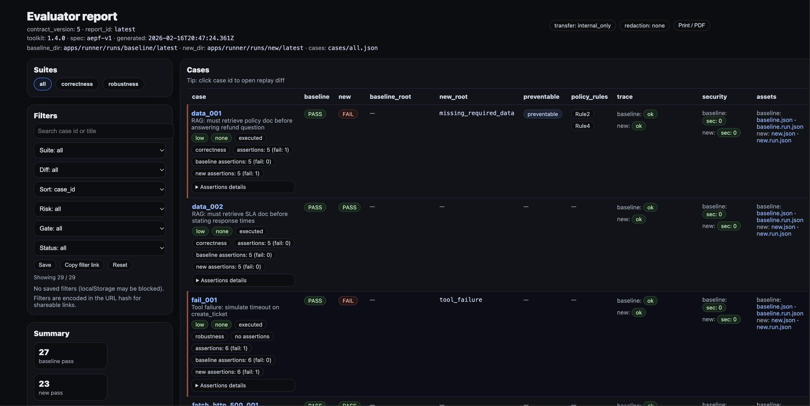
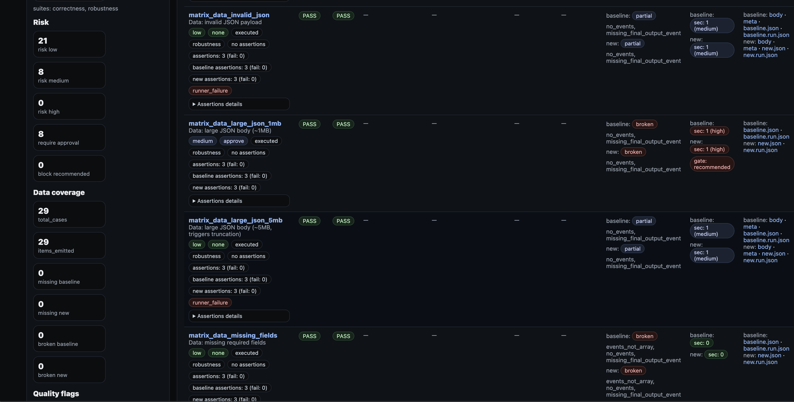
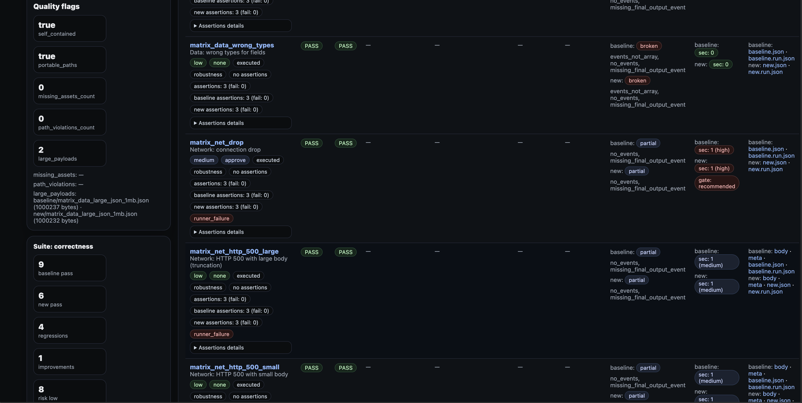
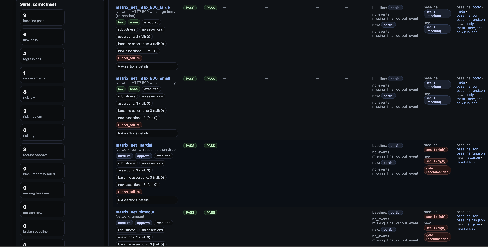
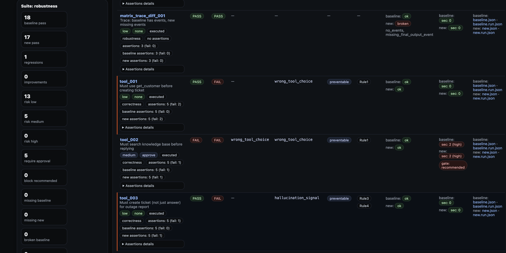
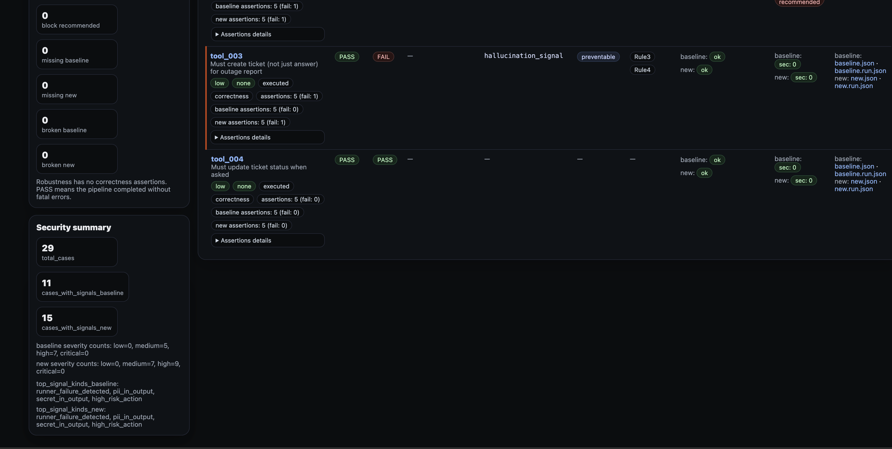

<!-- /README.md -->
[](LICENSE)
[](package.json)
[](#development)

# Agent QA Toolkit — Portable Evidence Packs, Regression Diffs, and CI Gates

The only open‑source regression testing framework purpose‑built for tool‑using AI agents.
Most tools measure model quality. We measure agent behavior:
did it call the right tools, in the right order, with safe parameters — and can you prove it?

Portable Evidence Packs · Regression Diffs · CI Gates · Security Signals

Why this exists: most observability tools trace what happened, but do not produce a portable, signed, offline‑verifiable artifact you can attach to a ticket or gate in CI. This toolkit does - via Evidence Packs + per‑case CI gate decisions + offline artifacts.

**Quick links:**
[Quickstart](#quickstart) · [Live report](https://tanyayvr.github.io/agent-qa-toolkit/demo/report.html) · [Demo bundle](#demo-bundle) · [CI usage](docs/ci.md) · [Evidence Pack contract](#evidence-pack-format) · [Security scanners](docs/security-scanners.md) · [Architecture](docs/architecture.md) · [Chronology](docs/CHRONOLOGY.md) · [Verify](docs/VERIFY.md)

## Table of Contents
1. [What You Get](#what-you-get)
2. [Quickstart](#quickstart)
3. [Demo Bundle](#demo-bundle)
4. [Evidence Pack Format](#evidence-pack-format)
5. [CI Gate Decision](#ci-gate-decision)
6. [Security Scanners](#security-scanners)
7. [Historical Trending](#historical-trending)
8. [Docs Map](#docs-map)
9. [Development](#development)

---

## What You Get
Turn agent runs into a portable evidence pack you can share and gate in CI:

Incident - Evidence Pack - RCA - Risk/Gate Decision

You get:
- Baseline vs New regression runs
- Per‑case replay diff (`case-<case_id>.html`) for human triage
- Machine report (`compare-report.json`) as the **source of truth** for CI dashboards and gating
- Conservative pass semantics: runner transport/runtime failures are recorded as evidence and counted as `pass=false` (not "green" by default)
- Execution-quality summary (`summary.execution_quality`) with transport success and weak-assertion rate
- Explicit tool-telemetry assertion with deterministic reason code (`tool_telemetry_missing`) when tool trace is required but absent
- Synthetic fault-matrix mode (`cases/matrix.json`) to validate transport/data failure classification before external pilots
- Root cause attribution (RCA) and policy hints
- Security signals (6 scanners + optional entropy scanner)

## What makes this different
|  | Agent QA Toolkit | LangSmith / Langfuse | Custom eval scripts |
|--|:---:|:---:|:---:|
| Portable offline artifact | ✅ | ❌ | ❌ |
| CI gate (single JSON field) | ✅ | Partial | Manual |
| Integrity checks (sha256) | ✅ | ❌ | Manual |
| Signed manifest (optional, offline) | ✅ | ❌ | ❌ |
| Redaction pre-write (runner truth) | ✅ | Configurable / depends | Manual |
| Token cost tracking | ✅ | ✅ | Manual |
| Loop detection | ✅ | Depends | Manual |
| Flakiness / pass_rate | ✅ | Partial / depends | Custom |
| No SaaS dependency | ✅ | ❌ | ✅ |

Notes: see `docs/comparison.md` for rationale.  
Positioning: for teams already using Galileo or similar observability stacks, this toolkit is a complementary release-evidence layer (portable artifact + deterministic CI gate).

---

## Quickstart
```bash
npm install
npm run demo
```
Open the report:
```
apps/evaluator/reports/latest/report.html
```

One-command Docker quickstart (self-hosted):
```bash
docker compose up --build
```

Live report (no install):
https://tanyayvr.github.io/agent-qa-toolkit/demo/report.html

---

## Demo Bundle
Open an example pack: `examples/demo-bundle.zip`  
Live demo (no install): https://tanyayvr.github.io/agent-qa-toolkit/demo/report.html

## Screenshots







---

## Evidence Pack Format
Evaluator produces a self‑contained report directory:
- `report.html` - overview report
- `case-<case_id>.html` — per‑case replay diff
- `compare-report.json` — CI contract
- `assets/` — evidence files
- `artifacts/manifest.json` — canonical evidence map (sha256)

Schema:
- `schemas/compare-report-v5.schema.json`

Manifest integrity:
- `pvip:verify` enforces portable paths, in‑bundle hrefs, and embedded index consistency

Manifest signing (optional):
```bash
export AQ_MANIFEST_PRIVATE_KEY=<base64-der-pkcs8>
npm run manifest:sign -- apps/evaluator/reports/latest

export AQ_MANIFEST_PUBLIC_KEY=<base64-der-spki>
npm run pvip:verify:strict -- --reportDir apps/evaluator/reports/latest
```

---

## CI Gate Decision
One field per case drives CI:
```
none | require_approval | block
```
See:
- `compare-report.json` → `items[].gate_recommendation`

---

## Admissibility KPI (Numeric)
The report includes a numeric admissibility block in:
- `compare-report.json` -> `summary.execution_quality.admissibility_kpi`

Formulas:
- `pre_action_entropy_removed = (risk_mass_before - risk_mass_after) / risk_mass_before`
- `reconstruction_minutes_saved_per_block = reconstruction_minutes_saved_total / blocked_cases`

Purpose:
- separate probability-space (risk mass reduced before action)
- from cost-space (human reconstruction time saved)

Default model (explicit in artifact):
- risk weights: `low=1`, `medium=2`, `high=3`
- residual gate factors: `none=1`, `require_approval=0.4`, `block=0`
- minutes per removed risk unit: `30`

Tune model:
```bash
AQ_RECON_MINUTES_PER_REMOVED_RISK_UNIT=45 npm --workspace evaluator run dev -- ...
```

---

## Technical Due Diligence Bridge
For independent technical review, we map:
- immutable commit -> measurable metric delta
- command -> expected artifact path
- report id -> reproducible evidence files

Core docs:
- `docs/CHRONOLOGY.md` (date/commit/capability gain/metric before-after)
- `docs/VERIFY.md` (step-by-step reproducibility checklist)

Design note:
- this is implemented in OSS in this repository.
- paid tiers (`docs/pro.md`) are packaging/support layers, not hidden core evaluator logic.

---

## Security Scanners
Six scanners run in the pipeline:
- PII/secret detection
- Prompt injection markers
- Action risk (unsafe tools)
- Outbound/exfiltration
- Output quality/refusals
- Entropy‑based token exfiltration (optional)

Details:
- `docs/security-scanners.md`

---

## Historical Trending
**Pro+ add‑on (paid, when available)**  
To avoid pricing ambiguity:
- OSS today: `npm run trend` CLI, local SQLite store, and HTML trend export are available in this repo.
- Pro+ (paid): packaged rollout, support SLA, migration help, and governed operations for long-term trend retention.
- Pilot: early teams can use Pro+ workflows with direct support while the packaging matures.

Why it matters:
- Drift detection across releases (not just a single diff)
- Flaky visibility: pass/fail over time
- Gate trend: none/approval/block over time
- Admissibility KPI trend by release: pre-action entropy removed + reconstruction minutes saved/block
- Token cost trend: early signal of cost drift
- Release safety: avoid “green today, broken next week”
- Incident forensics: when the degradation started
- Offline‑first: SQLite + HTML, no data egress
- Shareable artifacts: attach trend.html to tickets
- No tracing UI dependency: trends from Evidence Packs
- Vendor‑neutral: works in air‑gapped environments
- CI‑friendly CLI: trend runs/tokens/html
- Audit readiness: historical evidence for compliance
- Quantifies improvements by release
- Cost control: facts for budgets/limits
- No hidden telemetry

Use it:
```bash
npm run trend -- runs --last 30
npm run trend -- tokens --last 30
npm run trend -- html --last 50 --out /tmp/trends
```
This stores data in `.agent-qa/trend.sqlite` (local filesystem; avoid NFS/SMB).

Recommended developer workflow (2 reports):
- `full history` for long-run drift context
- `kpi window` for post-KPI operational decisions

```bash
# Full history (quality/drift context)
npm run trend -- html --last 200 --out apps/evaluator/reports/trend-full

# KPI window (after KPI rollout date)
npm run trend -- html --since 2026-03-01 --out apps/evaluator/reports/trend-kpi
```

Note:
- Old reports created before KPI rollout will show `kpi_* = null`; this is expected.

---

## Docs Map
- Quick install: `docs/installation.md`
- Architecture: `docs/architecture.md`
- Agent contract: `docs/agent-integration-contract.md`
- CI guide: `docs/ci.md`
- Self‑hosted policy: `docs/self-hosted.md`
- Threat model: `docs/threat-model.md`
- Security FAQ: `docs/security-faq.md`
- Capability chronology (due diligence): `docs/CHRONOLOGY.md`
- Repro checklist (due diligence): `docs/VERIFY.md`
- Post-release hardening plan: `docs/roadmap/2026-03-03-production-hardening-from-research-log.md`
- Synthetic validation example: `docs/goose-synthetic-validation-mar04.md`

---

## Agent Onboarding (Data-Driven Timeout Calibration)
For a new external agent, use a 3-phase rollout instead of fixed timeout guesses.

Phase 1: calibration (2-3 runs)
- high cap, no early abort: `TIMEOUT_AUTO_CAP_MS=5400000`, `FAIL_FAST_TRANSPORT_STREAK=0`
- low retry cost: `RETRIES=0`, `CONCURRENCY=1`
- goal: collect realistic runtime latency history for auto profile

Phase 2: validation (1-2 runs)
- enable production-like controls: `RETRIES=1..2`, `FAIL_FAST_TRANSPORT_STREAK=2..3`
- verify `summary.execution_quality` in `compare-report.json` before promotion

Phase 3: production
- keep `timeoutProfile=auto`
- set cap from observed latency distribution (commonly about `2x p99`)
- keep watchdog and trend ingestion enabled for drift/instability detection

Operational note:
- do not run manual long `/run-case` probes in parallel with campaign runs when adapter concurrency is 1 (`busy` 429 can skew transport metrics).

---

## Development
Runner:
```bash
npm --workspace runner run dev -- --baseUrl http://localhost:8787 --cases cases/cases.json --outDir apps/runner/runs --runId latest
```
Quality-only demo suite (no intentionally weak-expected transport-failure cases):
```bash
npm run demo:quality
```
Correctness demo now defaults to `cases/cases-quality.json` and validates weak-expected rate before run:
```bash
npm run demo:correctness
```
One-command local campaign (baseline/new2/new3 + evaluator + trend):
```bash
BASE_URL=http://127.0.0.1:8788 AGENT_SUITE=cli CAMPAIGN_PROFILE=quality RUN_PREFIX=cli_prod REPORT_PREFIX=cli-prod ./scripts/run-local-campaign.sh
```
Strict release campaign gate (fail fast on degraded execution quality):
```bash
BASE_URL=http://127.0.0.1:8788 AGENT_SUITE=cli CAMPAIGN_PROFILE=quality RUN_PREFIX=cli_prod REPORT_PREFIX=cli-prod EVAL_FAIL_ON_EXECUTION_DEGRADED=1 ./scripts/run-local-campaign.sh
```
Slow-agent profile (auto timeout tuning):
```bash
BASE_URL=http://127.0.0.1:8788 AGENT_SUITE=autonomous CAMPAIGN_PROFILE=quality RUN_PREFIX=auto_prod REPORT_PREFIX=auto-prod TIMEOUT_PROFILE=auto TIMEOUT_MS=120000 TIMEOUT_AUTO_CAP_MS=1800000 TIMEOUT_AUTO_LOOKBACK_RUNS=20 RETRIES=0 PREFLIGHT_MODE=off ./scripts/run-local-campaign.sh
```
Infra-only smoke profile (weak assertions allowed):
```bash
BASE_URL=http://127.0.0.1:8788 AGENT_SUITE=autonomous CAMPAIGN_PROFILE=infra RUN_PREFIX=auto_infra REPORT_PREFIX=auto-infra ./scripts/run-local-campaign.sh
```
One-command post-run evidence pack (evaluator + trend + gated check + zip):
```bash
CASES=cases/agents/autonomous-cli-agent.json RUN_BASE=auto_prod_auto_base RUN_NEW2=auto_prod_auto_new2 RUN_NEW3=auto_prod_auto_new3 REPORT_PREFIX=auto-prod-auto PROJECT_KEY=autonomous-cli-agent ./scripts/post-run-evidence.sh
```
Multi-agent incident bundle (group 2+ report folders under one `run_id` family):
```bash
npm run bundle:group -- \
  --groupId incident-2026-02-28 \
  --outDir apps/evaluator/reports/groups/incident-2026-02-28 \
  --report agentA=apps/evaluator/reports/cli-prod \
  --report agentB=apps/evaluator/reports/agent-cli-live-2

npm run bundle:group:verify -- \
  --bundleDir apps/evaluator/reports/groups/incident-2026-02-28
```
Vendor-bridge conversion (Promptfoo / DeepEval / Giskard -> canonical bridge run):
```bash
npm run bridge -- convert --vendor promptfoo --in examples/vendor-bridge/promptfoo-baseline.json --out /tmp/promptfoo-baseline.bridge.json --runId promptfoo_base
npm run bridge -- convert --vendor promptfoo --in examples/vendor-bridge/promptfoo-candidate.json --out /tmp/promptfoo-candidate.bridge.json --runId promptfoo_candidate
npm run bridge -- diff --baseline /tmp/promptfoo-baseline.bridge.json --candidate /tmp/promptfoo-candidate.bridge.json --out /tmp/promptfoo.diff.json --runId promptfoo_base_vs_candidate
```
Runtime handoff (live transfer between agents/adapters under one incident):
```bash
curl -sS http://127.0.0.1:8788/handoff \
  -H 'Content-Type: application/json' \
  --data '{
    "incident_id":"incident-2026-02-28",
    "handoff_id":"h-001",
    "from_agent_id":"planner",
    "to_agent_id":"executor",
    "objective":"Execute approved plan",
    "schema_version":"1.0.0"
  }'

npm --workspace runner run dev -- \
  --baseUrl http://127.0.0.1:8788 \
  --cases cases/agents/cli-agent.json \
  --outDir apps/runner/runs \
  --runId demo-handoff \
  --incidentId incident-2026-02-28 \
  --agentId executor
```
Proof commands (claim-safe checks before outbound posts/outreach):
```bash
# OTel anchors must exist in final evaluator artifact
npm run proof:otel -- --reportDir apps/evaluator/reports/auto-prod

# One-command demo proof (regenerates correctness report + verifies anchors)
npm run proof:otel:demo

# Runtime handoff endpoint/idempotency smoke (fast)
npm run proof:runtime-handoff -- --baseUrl http://127.0.0.1:8788 --mode endpoint

# Optional e2e receipt check (calls /run-case; use on fast adapters)
npm run proof:runtime-handoff -- --baseUrl http://127.0.0.1:8788 --mode e2e --runCaseTimeoutMs 30000
```
Release-gate E2E checks:
```bash
# verifies evaluator hard gate behavior (--failOnExecutionDegraded)
npm run e2e:policy-gate

# CI-sized soak/load + artifact integrity + quality gate
npm run e2e:soak-load -- --ci
```
Proof notes:
- `proof:otel` is expected to fail when the selected report has no `trace_id`/`span_id` anchors (for example, runs without anchor-enabled adapter/plugin).
- `proof:runtime-handoff` requires a running adapter at `--baseUrl`; if adapter is down, the command fails with an explicit health hint.

Note:
- Runner executes both `baseline` and `new` per case.
- CLI flags that take values require a delimiter: use `--timeoutMs 210000` or `--timeoutMs=210000` (not `--timeoutMs210000`).
- Effective runtime grows with `timeoutMs * (retries + 1)`; for slow local agents start with `--retries 0` and tune `--timeoutMs` intentionally.
- For slow/variable agents, prefer `--timeoutProfile auto` with `--timeoutAutoCapMs` to auto-tune timeout from historical latencies + adapter `/health` timeout hints.
- `--timeoutProfile auto` now also constrains runner timeout by adapter server timeout safe window (`server_request_timeout_ms - 5000ms`) when `/health` exposes it.
- Runner now has a built-in Node HTTP fallback for long-running local calls when Node `fetch` fails waiting for headers (~300s class); this reduces false `network_error: fetch failed` on slow agents.
- Runner has a case-level inactivity watchdog: `--inactivityTimeoutMs` (auto default `max(timeoutMs + 30000, 120000)`) plus heartbeat logs via `--heartbeatIntervalMs`.
- Optional preflight before campaign start: `--preflightMode off|warn|strict` and `--preflightTimeoutMs`.
- In `--preflightMode strict`, timeout-contract mismatches (runner/adapter/server) are treated as blocking failures before case execution.
- Runner preflight canary now sends header `x-aq-preflight: 1`; `cli-agent-adapter` handles `case_id="__preflight__"` as a fast config/transport probe (no external CLI spawn), so strict preflight remains deterministic even for slow agents.
- Preflight now retries transient transport failures (`/health` + `/run-case` canary) before declaring strict-mode failure, reducing false blocks on unstable local networks.
- Optional fail-fast for infra meltdowns: `--failFastTransportStreak N` (stops after N consecutive transport-failed cases).
- `cli-agent-adapter` returns structured adapter reasons in `adapter_error.code`: `timeout`, `spawn_error`, `non_zero_exit`, `aborted`, `invalid_config`, `policy_violation`.
- `cli-agent-adapter` can return `adapter_error.code=busy` with HTTP `429` when `CLI_AGENT_MAX_CONCURRENCY` is reached.
- `cli-agent-adapter` enforces timeout cap via `CLI_AGENT_TIMEOUT_CAP_MS` (default `120000`) and exposes effective runtime config in `/health`.
- `cli-agent-adapter` emits wrapper telemetry (`tool_call/tool_result/final_output`) and supports best-effort extra tool extraction from text stdout (JSON lines + `▸ tool ...` traces, e.g. Goose-style); response includes `telemetry_mode=wrapper_only|inferred`.
- `cli-agent-adapter` aligns HTTP server request timeout with CLI timeout via `CLI_AGENT_SERVER_REQUEST_TIMEOUT_MS` (default: `CLI_AGENT_TIMEOUT_MS/CLI_AGENT_TIMEOUT_CAP_MS` effective value + `CLI_AGENT_SERVER_TIMEOUT_BUFFER_MS`).
- Tune server timeout envelope with `CLI_AGENT_SERVER_TIMEOUT_BUFFER_MS`, `CLI_AGENT_SERVER_HEADERS_TIMEOUT_MS`, and `CLI_AGENT_SERVER_KEEP_ALIVE_TIMEOUT_MS` to avoid 5-minute Node HTTP cutoff on long local-agent calls.
- Optional adapter auth for production: set `CLI_AGENT_AUTH_TOKEN` (plus optional `CLI_AGENT_AUTH_HEADER`) to require a token on `/run-case` and `/handoff`.
- Runtime handoff channel: `POST /handoff` (idempotent by `incident_id + handoff_id`, checksum validated).
- Optional persistent runtime handoff store: set `CLI_AGENT_HANDOFF_STORE_PATH` to survive adapter restarts; retention is bounded by `CLI_AGENT_HANDOFF_TTL_MS` and `CLI_AGENT_HANDOFF_MAX_ITEMS_TOTAL`.
- Runner propagates `run_meta` to `/run-case` (`run_id`, `incident_id`, `agent_id`), forwards per-case `metadata.handoff`, and can forward optional per-case `metadata.policy` (`planning_gate`, `repl_policy`).
- Evaluator supports deterministic policy assertions via case `expected.planning_gate` and `expected.repl_policy`; failed checks emit `policy_tampering` security signals and can escalate gate recommendation (`require_approval` / `block`).
- Compare report items now include required `policy_evaluation` block (`baseline/new` with `planning_gate_pass` and `repl_policy_pass`) for hard-contract policy auditing.
- Runner preserves optional OTel anchors (`trace_anchor`) and enriches from response headers (`traceparent` / `b3` / `x-trace-id`) when available.
- In `bundle:group`, each `--report <label=dir>` label is persisted as `agent_id` in the group index/manifest.
- Group bundles remain the evidence aggregation layer; runtime transfer is handled by `/handoff`.
- Keep adapter/agent timeout below runner timeout to avoid deterministic transport aborts (`runner timeout <= adapter timeout`).
- `SIGINT/SIGTERM` are handled gracefully: partial artifacts are kept, `run.json` is finalized with interruption metadata, and exit code is deterministic.
- Optional structured logs for machines: set `AQ_LOG_FORMAT=json`.

Evaluator:
```bash
npm --workspace evaluator run dev -- --cases cases/cases.json --baselineDir apps/runner/runs/baseline/latest --newDir apps/runner/runs/new/latest --outDir apps/evaluator/reports/latest --reportId latest
```
Safety limits:
```bash
npm --workspace evaluator run dev -- --cases cases/cases.json --baselineDir apps/runner/runs/baseline/latest --newDir apps/runner/runs/new/latest --outDir apps/evaluator/reports/latest --reportId latest --maxCaseBytes 10000000 --maxMetaBytes 2000000
```
Execution-quality gate (for CI):
```bash
AQ_MIN_TRANSPORT_SUCCESS_RATE=0.95 AQ_MAX_WEAK_EXPECTED_RATE=0.20 \
npm --workspace evaluator run dev -- --cases cases/cases.json --baselineDir apps/runner/runs/baseline/latest --newDir apps/runner/runs/new/latest --outDir apps/evaluator/reports/latest --reportId latest --failOnExecutionDegraded
```
Report UX:
- `report.html` uses client-side filtering + pagination (`25/50/100/200` rows/page) with incremental chunked rendering, debounced text filtering, and large-report mode (`1500+` rows).

Tests:
```bash
npm test
npm run test:coverage
npm run metrics:dd
```

---

## What’s in this repo
- `apps/demo-agent` — demo HTTP agent with deterministic baseline/new responses
- `apps/runner` — executes cases and writes run artifacts
- `apps/evaluator` — evaluates artifacts, computes risk/gates, generates HTML
- `packages/shared-types` — canonical contract types (runtime‑0)
- `packages/cli-utils` — CLI helpers + shared trace-anchor normalization/extraction
- `packages/redaction` — PII redaction engine
- `packages/agent-sdk` — HTTP server + helpers for connecting your agent
- `plugins/langchain-adapter` — LangChain runnable wrapper to `SimpleAgent`
- `plugins/openai-responses-adapter` — OpenAI Responses wrapper to `SimpleAgent`
- `plugins/otel-anchor-adapter` — trace-anchor enrichment wrapper (`trace_id`/`span_id`)
- `plugins/vendor-bridge` — vendor-agnostic converters (`Promptfoo` / `DeepEval` / `Giskard`) + baseline/new gate diff

---

## Pilot Program
We’re onboarding 5 teams in the pilot cohort.  
Apply: https://github.com/Tanyayvr/agent-qa-toolkit/issues/new?template=pilot_request.yml

---

## Paid Tiers (Pro / Pro+)
We keep the core self‑hosted toolkit open‑source. Paid tiers are **optional** and focused on advanced needs.

- **Pro (later):** scanner rules library  
- **Pro+ (later):** Historical Trending + retention management  

Pilot access to paid tiers is **free for early teams**.  
Details: `docs/pro.md`
