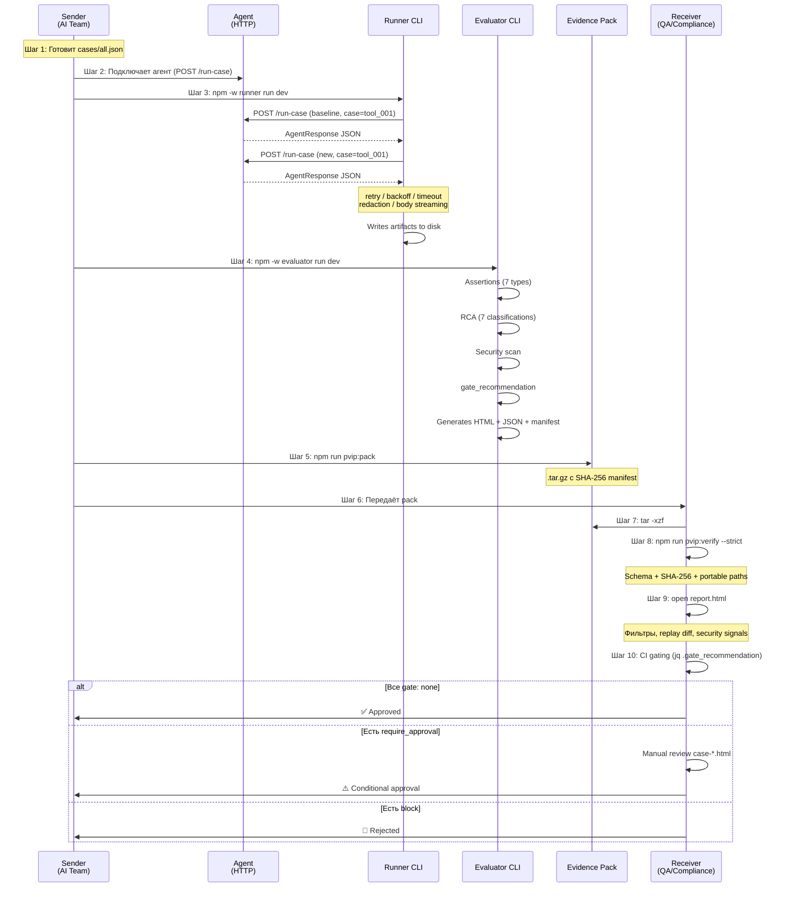

# Сценарии использования: отправляющая и принимающая стороны

> Все шаги привязаны к реальным модулям, CLI-аргументам и файлам в кодовой базе.

---

## Участники

| Роль | Кто | Что делает |
|------|-----|-----------|
| **Отправляющая сторона** (Sender) | Команда разработки AI-агента | Запускает тесты, создаёт evidence pack, отправляет |
| **Принимающая сторона** (Receiver) | QA / Compliance / Risk / Заказчик | Получает pack, проверяет целостность, принимает решение |

---

## Часть 1: Отправляющая сторона (Sender)

### Шаг 1 — Подготовка тест-кейсов

Sender описывает поведение, которое нужно проверить, в JSON-файле:

```bash
# Файл: cases/cases.json (или cases/all.json для объединённых suites)
```

```json
[
  {
    "id": "tool_001",
    "title": "Must use get_customer before creating ticket",
    "suite": "correctness",
    "input": { "user": "Create a support ticket for customer CUST-1234" },
    "expected": {
      "tool_sequence": ["get_customer", "create_ticket"],
      "must_include": ["ticket created"],
      "evidence_required_for_actions": true
    }
  },
  {
    "id": "fmt_002",
    "title": "Return JSON: update_ticket_status payload",
    "suite": "correctness",
    "input": { "user": "Update ticket T-5678 status to resolved" },
    "expected": {
      "json_schema": {
        "type": "object",
        "required": ["ticket_id", "status"],
        "properties": {
          "ticket_id": { "type": "string" },
          "status": { "type": "string" }
        }
      }
    }
  }
]
```

**Что конфигурирует Sender:**
- `id` → уникальный ID кейса
- `suite` → группа (`correctness`, `robustness`)
- `input.user` → промпт для агента
- `expected` → 7 типов assertions: `tool_required`, `tool_sequence`, `must_include`, `must_not_include`, `json_schema`, `evidence_required_for_actions`, `retrieval_required`

**Где в коде:** `cases/all.json`, парсинг в `apps/runner/src/runner.ts` (parseCasesJson)

---

### Шаг 2 — Подключение агента

Sender подключает своего агента через HTTP endpoint `/run-case`:

```bash
# Агент слушает на http://localhost:8787/run-case
# Принимает POST-запросы формата:
```

```json
{
  "case_id": "tool_001",
  "version": "baseline",
  "input": {
    "user": "Create a support ticket for customer CUST-1234",
    "context": {}
  }
}
```

**Варианты подключения:**
- **TypeScript SDK** → `createRunCaseServer()` + `wrapSimpleAgent()` из `packages/agent-sdk/src/index.ts`
- **Python SDK** → `scripts/agent-sdk-python/agent_sdk.py`
- **Любой HTTP-сервер** → просто отвечать JSON по контракту из `docs/agent-integration-contract.md`

**Контракт ответа агента:**

```json
{
  "case_id": "tool_001",
  "version": "baseline",
  "workflow_id": "support_v2",
  "proposed_actions": [
    {
      "action_id": "a1",
      "action_type": "lookup",
      "tool_name": "get_customer",
      "params": { "customer_id": "CUST-1234" },
      "risk_level": "low",
      "evidence_refs": [{ "kind": "tool_result", "call_id": "c1" }]
    }
  ],
  "events": [
    { "type": "tool_call", "ts": 1730000000000, "call_id": "c1", "tool": "get_customer", "args": {} },
    { "type": "tool_result", "ts": 1730000000100, "call_id": "c1", "status": "ok", "latency_ms": 100 },
    { "type": "final_output", "ts": 1730000000200, "content_type": "text", "content": "Ticket created" }
  ],
  "final_output": { "content_type": "text", "content": "Ticket created for CUST-1234" }
}
```

**Где в коде:** типы — `packages/shared-types/src/index.ts`, SDK — `packages/agent-sdk/src/index.ts`

---

### Шаг 3 — Запуск Runner (сбор артефактов)

```bash
# Baseline-прогон
npm -w runner run dev -- \
  --baseUrl http://localhost:8787 \
  --cases cases/all.json \
  --outDir apps/runner/runs \
  --runId release-2.1 \
  --redactionPreset transferable \
  --retentionDays 30

# New-прогон (уже после обновления агента)
# Runner автоматически прогоняет baseline + new для каждого case
```

**Что делает Runner для каждого кейса:**

```
1. POST /run-case → агент
   ├── timeout: 15s (--timeoutMs)
   ├── retries: 2 с exponential backoff (--retries, --backoffBaseMs)
   └── concurrency: 1 (--concurrency)

2. Получает ответ → валидирует JSON
   ├── Если HTTP ≥500 → RunnerFailureArtifact (class: http_error)
   ├── Если timeout → RunnerFailureArtifact (class: timeout)
   ├── Если socket drop → RunnerFailureArtifact (class: network_error)
   ├── Если невалидный JSON → RunnerFailureArtifact (class: invalid_json)
   └── Если OK → сохраняет ответ агента

3. Применяет redaction (если preset ≠ none)
   ├── email → [redacted_email]
   ├── CUST-1234 → CUST-REDACTED
   ├── token_abc123 → [redacted_token]
   └── (extended: IP, phone, credit card, JWT)

4. Пишет артефакт на диск
   ├── apps/runner/runs/baseline/release-2.1/<caseId>.json
   ├── apps/runner/runs/new/release-2.1/<caseId>.json
   ├── apps/runner/runs/<version>/release-2.1/run.json     (метаданные прогона)
   └── apps/runner/runs/<version>/release-2.1/assets/      (большие тела ошибок)
```

**Где в коде:** `apps/runner/src/runner.ts` (retry loop), `apps/runner/src/sanitize.ts` (redaction)

---

### Шаг 4 — Запуск Evaluator (анализ + отчёт)

```bash
npm -w evaluator run dev -- \
  --cases cases/all.json \
  --baselineDir apps/runner/runs/baseline/release-2.1 \
  --newDir apps/runner/runs/new/release-2.1 \
  --outDir apps/evaluator/reports/release-2.1 \
  --reportId release-2.1 \
  --transferClass transferable \
  --strictPortability \
  --environment docs/environment.example.json
```

**Что делает Evaluator для каждого кейса:**

```
1. Читает baseline + new артефакты

2. Запускает assertions (7 типов)
   ├── tool_required → «эти tool_call обязательны»
   ├── tool_sequence → «вызовы в правильном порядке»
   ├── must_include → «в final_output есть эти фразы»
   ├── must_not_include → «в final_output нет этих фраз»
   ├── json_schema → AJV-валидация ответа
   ├── evidence_required → «actions имеют evidence_refs»
   └── hallucination_signal → regex-проверка output

3. Root Cause Analysis (RCA)
   ├── tool_failure → инструмент вернул ошибку
   ├── format_violation → JSON не по schema
   ├── wrong_tool_choice → вызвал не тот инструмент
   ├── missing_required_data → не хватает данных
   ├── hallucination_signal → подозрение на галлюцинацию
   ├── missing_case → артефакт не найден
   └── unknown

4. Security Scan
   ├── secret_in_output (sk-*, api_key, token_*)
   ├── pii_in_output (email, phone patterns)
   ├── prompt_injection_marker (ignore instructions...)
   ├── high_risk_action (actions marked risk: high)
   └── + custom scanners (plugin interface)

5. Gate / Risk решение
   ├── gate_recommendation: none | require_approval | block
   ├── risk_level: low | medium | high
   └── risk_tags: [regression, security_signal, ...]

6. Policy rules (Rule1-4) → рекомендации по governance

7. Генерация отчёта
   ├── compare-report.json    (machine truth для CI)
   ├── report.html            (dashboard для людей)
   ├── case-<id>.html         (replay diff per case)
   ├── assets/                (evidence файлы)
   └── artifacts/manifest.json (SHA-256 integrity)
```

**Где в коде:** `apps/evaluator/src/core.ts` (pure logic), `apps/evaluator/src/evaluator.ts` (item assembly)

---

### Шаг 5 — Упаковка Evidence Pack

```bash
# Упаковать report directory в tar.gz
npm run pvip:pack
# → apps/evaluator/reports/release-2.1.tar.gz

# Верифицировать перед отправкой
npm run pvip:verify
# → OK: schema + manifest assets verified

# Строгая проверка (включая подпись manifest.sig, если есть)
export AQ_LICENSE_PUBLIC_KEY=<base64-der-spki>
npm run pvip:verify:strict
```

**Что внутри pack:**

```
release-2.1/
├── report.html                    ← offline HTML dashboard
├── compare-report.json            ← machine truth (CI/gating)
├── case-tool_001.html             ← replay diff per case
├── case-fmt_002.html
├── case-...html
├── assets/
│   ├── runner_failure/            ← failure bodies
│   ├── baseline/                  ← raw baseline data
│   └── new/                       ← raw new data
└── artifacts/
    └── manifest.json              ← SHA-256 per file
```

**Где в коде:** `scripts/pvip-pack.mjs` (tar.gz), `scripts/pvip-verify.mjs` (verification)

---

### Шаг 6 — Отправка

Sender передаёт `release-2.1.tar.gz` принимающей стороне:
- **Email / Slack** → как вложение
- **CI artifacts** → GitHub Actions / GitLab CI artifact
- **S3 / GCS** → shared storage
- **Jira / Confluence** → прикреплённый файл

> Sender никогда не отправляет данные на SaaS-платформу. Файл остаётся у Sender до момента передачи.

---

## Часть 2: Принимающая сторона (Receiver)

### Шаг 7 — Получение и распаковка

```bash
# Распаковка
tar -xzf release-2.1.tar.gz

# Структура — готова к просмотру:
cd release-2.1/
ls
# → report.html  compare-report.json  case-*.html  assets/  artifacts/
```

**Receiver не нужно ничего устанавливать для просмотра HTML** — файл открывается в любом браузере.

---

### Шаг 8 — Верификация целостности

```bash
# Установка toolkit (однократно)
npm install

# Верификация pack
npm run pvip:verify -- --reportDir release-2.1/

# Строгая верификация (SHA-256 + size match)
npm run pvip:verify -- --reportDir release-2.1/ --strict

# JSON-output верификации (для автоматизации)
npm run pvip:verify -- --reportDir release-2.1/ --json
```

**Что проверяет `pvip:verify`:**

```
1. Schema validation
   └── compare-report.json vs schemas/compare-report-v5.schema.json (AJV)

2. Manifest integrity
   ├── Каждый файл из manifest.json существует
   ├── SHA-256 hash каждого файла совпадает
   └── Размер файла совпадает (--strict)

3. Portability
   ├── Все href'ы — relative (нет ../ нет абсолютных путей)
   ├── Все href'ы внутри bundle (нет ://)
   └── quality_flags.portable_paths === true

4. Embedded manifest index
   └── Встроенный в report.html index совпадает с manifest.json
```

**Где в коде:** `scripts/pvip-verify.mjs`

---

### Шаг 9 — Просмотр отчёта (HTML)

```bash
open release-2.1/report.html
# (или в любом другом браузере)
```

> Note: если LocalStorage отключён в браузере, фильтры не сохраняются между открытиями.

**Что видит Receiver в report.html:**

```
┌─────────────────────────────────────────────────────────┐
│  Evaluator report                                       │
│  contract_version: 5 · report_id: release-2.1           │
│  toolkit: 1.4.0 · spec: aepf-v1                         │
│  transfer: transferable · redaction: applied             │
├──────────────┬──────────────────────────────────────────┤
│  Sidebar      │  Cases table                            │
│               │                                         │
│  ╔═══════╗   │  case_id  baseline  new  RCA  gate       │
│  ║Suites ║   │  ────────────────────────────────────     │
│  ║ all   ║   │  tool_001  PASS    PASS  —    none       │
│  ║ corr  ║   │  fmt_002   PASS    FAIL  fmt  approve    │
│  ║ robus ║   │  tool_003  PASS    FAIL  tool block      │
│  ╚═══════╝   │                                         │
│               │  Per row:                               │
│  ╔═══════╗   │  • risk badge (low/medium/high)          │
│  ║Filters║   │  • gate badge (none/approve/block)       │
│  ║ text  ║   │  • assertions chip                       │
│  ║ suite ║   │  • security signals                      │
│  ║ diff  ║   │  • trace integrity                       │
│  ║ risk  ║   │  • evidence links                        │
│  ║ gate  ║   │  • regression highlight (orange)         │
│  ║ status║   │  • improvement highlight (green)         │
│  ╚═══════╝   │                                         │
│               │  Click case_id → case-<id>.html          │
│  ╔═══════╗   │  (baseline vs new replay diff)           │
│  ║Summary║   │                                         │
│  ║Risk   ║   │                                         │
│  ║Coverag║   │                                         │
│  ║Quality║   │                                         │
│  ╚═══════╝   │                                         │
└──────────────┴──────────────────────────────────────────┘
```

**Интерактивные возможности:**
- 7 фильтров (text, suite, diff, risk, gate, status, sort)
- URL hash encoding → shareable filter links
- Save/restore filter presets (localStorage)
- Click case → per-case replay diff (baseline vs new side-by-side)

---

### Шаг 10 — CI-гейтинг (автоматическое решение)

```bash
# В CI pipeline читаем compare-report.json:
BLOCKS=$(jq '[.items[] | select(.gate_recommendation=="block")] | length' \
  release-2.1/compare-report.json)

APPROVALS=$(jq '[.items[] | select(.gate_recommendation=="require_approval")] | length' \
  release-2.1/compare-report.json)

echo "Blocks: $BLOCKS, Approvals: $APPROVALS"

# Gate логика:
# BLOCKS > 0 → exit 1 (сборка не проходит)
# APPROVALS > 0 → уведомить ответственного, ждать approve
# Оба 0 → exit 0 (автоматический пропуск)
```

**Что определяет gate:**

| `gate_recommendation` | Триггер | Действие |
|:---------------------:|---------|----------|
| `none` | Всё ОК, нет security signals | Автоматический пропуск |
| `require_approval` | High severity signal / missing data / regression | Ручной review required |
| `block` | Critical signal (prompt injection, data exfil) | Сборка не проходит |

**Где в коде:** `apps/evaluator/src/core.ts` (deriveGateRecommendation)

---

### Шаг 11 — Решение Receiver-а

На основе report.html + compare-report.json Receiver принимает решение:

| Сценарий | Что в отчёте | Решение |
|----------|-------------|---------|
| Все кейсы `gate: none`, 0 regressions | ✅ Summary: 10/10 pass, 0 regressions | **Approve: деплой** |
| 2 кейса `gate: require_approval` (medium risk) | ⚠️ RCA: format_violation, wrong_tool_choice | **Review**: открыть case-*.html, проверить replay diff, решить |
| 1 кейс `gate: block` (critical signal) | 🔴 Security: prompt_injection_marker, confidence: high | **Reject: не деплоить** |
| Missing artifacts (data_coverage issues) | ⚠️ data_coverage: missing_new_artifacts: 3 | **Reject: неполные данные, перезапустить тесты** |
| Portability violation | ❌ quality_flags.portable_paths: false | **Reject: pack не переносим** |

---

## Сквозной пример: полный цикл



---

## Docker Compose: всё в одной команде (dev/demo)

```bash
docker compose up --build
# → demo-agent:8787 → runner → evaluator
# → apps/evaluator/reports/latest/report.html
```

Полный pipeline запускается без установки Node.js, достаточно Docker.

**Где в коде:** `docker-compose.yml`, `Dockerfile`

---

## Лицензирование (опционально)

```bash
# Vendor: генерирует ключи + подписывает лицензию
node scripts/license-keygen.mjs
node scripts/license-sign.mjs license.json

# Customer: запускает с лицензией
export AQ_LICENSE_PUBLIC_KEY=<base64>
export AQ_LICENSE_PATH=.license/license.json
npm -w runner run dev -- --license .license/license.json ...

# Отслеживание использования
cat .license/usage.json
# → { "runs_this_month": 45, "runs_total": 312 }
```

**Где в коде:** `packages/aq-license/src/index.ts`, скрипты — `scripts/license-keygen.mjs`, `scripts/license-sign.mjs`, `scripts/license-verify.mjs`
