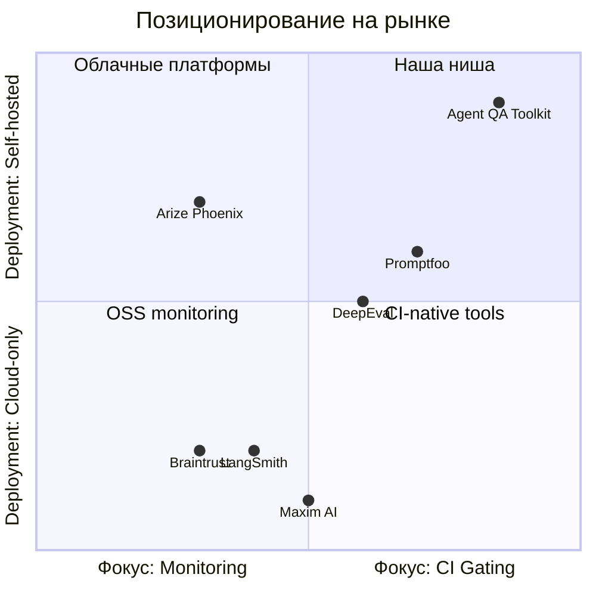
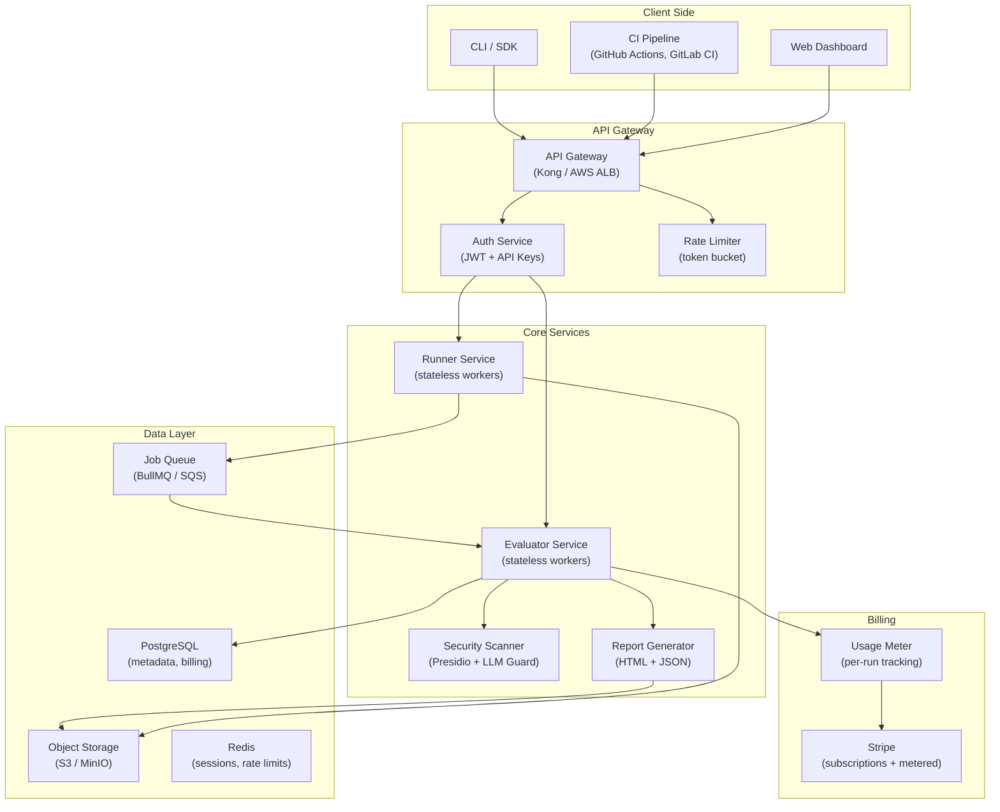
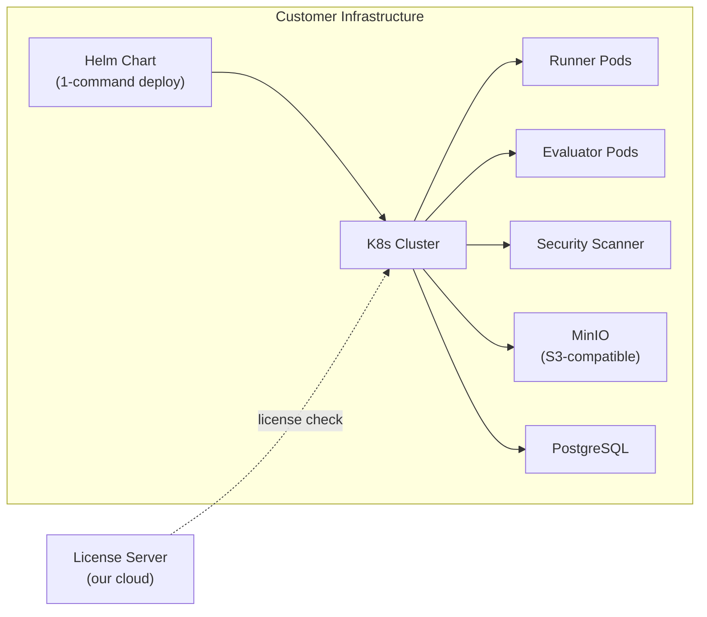
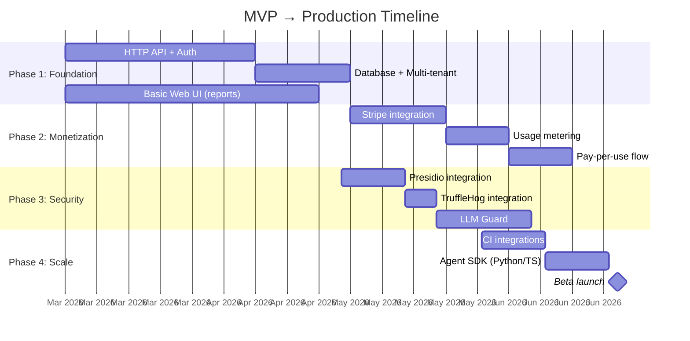

# Agent QA Toolkit: глубокое исследование перехода MVP → Production

---

## 1. Проект: что это и зачем

### Проблема

Компании, внедряющие AI-агентов (tool-using LLM agents), сталкиваются с **отсутствием инструментов для системного регрессионного тестирования**. Традиционные QA-подходы не работают:

- Агенты **недетерминированы** — один и тот же вход может дать разные выходы
- **Multi-step reasoning** — цепочки tool calls невозможно покрыть unit-тестами
- **Security-специфичные угрозы** — prompt injection, PII leakage, hallucinations — не покрываются классическим SAST/DAST
- **Нет стандарта** для evidence packs — каждая команда изобретает свой формат отчётов

### Решение

**Agent QA Toolkit** превращает прогоны AI-агента в **портативные evidence-пакеты** с:
- Сравнением baseline vs new (регрессионный diff)
- Machine-readable CI gating (`gate_recommendation: none | require_approval | block`)
- Root Cause Analysis (RCA) по каждому failure
- Security signal detection (PII, secrets, prompt injection)
- Self-hosted, local-first — данные не покидают инфраструктуру клиента

### Текущее состояние (MVP / Stage 1)

Монорепо (TypeScript, npm workspaces):

| Компонент | Что делает | LOC |
|-----------|-----------|-----|
| `runner` | CLI: прогоняет кейсы через агент, сохраняет артефакты | ~1050 |
| `evaluator` | CLI: сравнивает baseline/new, RCA, risk/gate, HTML-отчёты | ~2200 |
| `demo-agent` | Express-сервер с детерминированными ответами | ~400 + 32K JSON |
| `shared-types` | Каноничные TypeScript-типы | 144 |

**Работает**: lint, typecheck, unit tests, demo pipeline, HTML reports, CI gating JSON.
**Не работает для production**: нет multi-tenant, нет UI dashboard, нет API, regex-only security, нет billing.

---

## 2. Целевая аудитория (ICP)

### Первичная ЦА

| Сегмент | Кто это | Размер команды | Бюджет | Боль |
|---------|---------|---------------|--------|------|
| **AI/ML-инженеры в стартапах** | Строят агентов на LangChain/CrewAI/AutoGen | 2-10 чел. | $500-2K/мес | "Агент работал, обновили prompt — сломалось всё, а мы не знаем где" |
| **Enterprise AI-команды** | Внедряют агентов в бизнес-процессы (support, ops) | 10-50 чел. | $5K-30K/мес | "Compliance требует evidence pack при каждом release, а у нас Excel" |
| **AI security teams** | Отвечают за безопасность AI-систем | 3-15 чел. | $2K-10K/мес | "Prompt injection тестируем вручную, PII ловим глазами" |

### Вторичная ЦА

- **DevOps/Platform engineers** — интегрируют в CI/CD
- **QA-инженеры** переходящие в AI QA
- **Консультанты по AI compliance** (ISO 42001, EU AI Act)

### Голоса разработчиков (Reddit, HN, форумы)

> **Проблема #1: "Я не знаю, когда мой агент сломался"**
> *"The same input can yield different outputs. Traditional pass/fail testing is unreliable."* — Reddit r/MachineLearning
> Разработчики жалуются на отсутствие regression diff: невозможно понять, что изменилось между версиями агента.

> **Проблема #2: "Мультишаговые агенты непроверяемы"**
> *"Pinpointing the exact point of failure within a sequence of actions is cumbersome."* — HN
> Цепочка tool_call → tool_result → tool_call... делает дебаг экспоненциально сложнее.

> **Проблема #3: "Бенчмарки — фикция"**
> *"Current benchmarks are easily 'gameable' and not truly representative of real-world use cases."* — HN
> LLM-as-judge для оценки LLM создаёт shared blind spots.

> **Проблема #4: "Security — наугад"**
> *"We test prompt injection manually. PII detection is regex that misses 60% of cases."* — Reddit r/LLMDevs
> Нет стандартизированного пайплайна для security testing агентов.

> **Проблема #5: "Evidence pack? У нас логи в S3"**
> *"Compliance requires evidence for every release, and we have nothing standardized."* — Discord AI Engineering
> Нет portable формата для передачи результатов тестирования между командами.

---

## 3. Конкурентный ландшафт

### Прямые конкуренты

| Продукт | Фокус | Модель | Цена | Слабости |
|---------|-------|--------|------|----------|
| **Promptfoo** | Red-teaming, matrix testing | OSS + Cloud | Free / $49-499/мес | Нет CI gating, нет RCA, нет evidence packs |
| **DeepEval** | Unit-тесты для LLM (Pytest) | OSS + Cloud | Free / $39-299/мес | Нет tool-chain analysis, нет security signals |
| **LangSmith** | Tracing + eval (LangChain) | SaaS | Free / $39-399/мес | Lock-in к LangChain, нет offline mode |
| **Arize Phoenix** | Observability + tracing | OSS + SaaS | Free / Custom | Monitoring-first, не CI gating |
| **Maxim AI** | E2E simulation + eval | SaaS | Custom ($5K+/мес) | Enterprise-only, нет self-hosted |
| **Braintrust** | Human-in-the-loop eval | SaaS | Free / $50-500/мес | Нет automated security, нет evidence packs |

### Наше конкурентное преимущество



**Уникальная комбинация**:
1. **Portable evidence packs** — ни один конкурент не даёт self-contained report directory
2. **Self-hosted first** — данные не покидают инфраструктуру
3. **CI gating truth** — единый `gate_recommendation` для любой CI системы
4. **Версионированные контракты** — machine-readable, стабильные API для интеграций

---

## 4. Архитектура Production-системы

### 4.1. High-Level Architecture



### 4.2. Deployment

| Компонент | Технология | Почему |
|-----------|-----------|--------|
| **Оркестрация** | Kubernetes (EKS / GKE) | Auto-scaling workers по нагрузке |
| **API Gateway** | Kong или AWS ALB + Lambda Authorizer | Rate limiting, auth, routing |
| **Queue** | BullMQ (Redis) или AWS SQS | Decoupling runner ↔ evaluator |
| **Object Storage** | S3 (prod) / MinIO (self-hosted) | Evidence packs, reports |
| **Database** | PostgreSQL (RDS) | Users, orgs, billing, run metadata |
| **Cache** | Redis (ElastiCache) | Sessions, rate limits, job state |
| **CDN** | CloudFront | Раздача HTML-отчётов |
| **Monitoring** | Prometheus + Grafana + PagerDuty | SLA мониторинг |

### 4.3. Нагрузка и масштабирование

**Начальные оценки (Year 1):**

| Метрика | Значение | Обоснование |
|---------|---------|-------------|
| DAU (active users) | 50-200 | AI-команды, daily CI runs |
| Runs/day | 500-2000 | ~10 runs/user/day |
| Cases/run | 10-50 | Типичный test suite |
| Requests to agent/day | 5K-100K | cases × runs × 2 versions |
| Report generation/day | 500-2000 | 1 report per run |
| Storage/month | 50-200 GB | JSON artifacts + HTML reports |

**Масштабирование:**

| Нагрузка | Архитектура |
|----------|-------------|
| < 500 runs/day | Single node (VM), monolith |
| 500 - 5K runs/day | 2-3 workers + queue, horizontal scale |
| 5K - 50K runs/day | K8s с HPA, dedicated security scanner pods |
| > 50K runs/day | Multi-region, sharded storage, dedicated DB replicas |

### 4.4. Self-hosted вариант (для enterprise)



- **Helm chart** для однокнопочного деплоя
- Все данные остаются в инфраструктуре клиента
- License server — единственная внешняя связь

---

## 5. Безопасность в Production (Deep Dive)

### 5.1. Текущее состояние vs Production target

| Область | MVP (сейчас) | Production (target) |
|---------|-------------|-------------------|
| **Secret detection** | 6 regex (`api_key`, `sk-*`, etc.) | TruffleHog (800+ детекторов) + entropy analysis |
| **PII detection** | 3 regex (email, SSN, phone) | Microsoft Presidio (20+ entity types, multilingual) |
| **Prompt injection** | 5 строковых паттернов | LLM Guard + layered defense (regex → ML → LLM judge) |
| **Redaction** | 4 regex в `sanitize.ts` | Presidio Anonymizer (context-aware replacement) |
| **Auth** | Нет | JWT + API keys + RBAC |
| **Data isolation** | Нет (single-user CLI) | Tenant isolation (org-level namespacing) |
| **Audit log** | Нет | Immutable audit log (who ran what, when) |
| **Encryption** | Нет | At-rest (AES-256) + in-transit (TLS 1.3) |

### 5.2. Layered Security Architecture

```
┌─────────────────────────────────────────────────────┐
│ Layer 1: Input Validation                           │
│ - Schema validation (AJV, strict mode)              │
│ - Size limits (maxBodyBytes, warnBodyBytes)          │
│ - Rate limiting (token bucket per org)              │
├─────────────────────────────────────────────────────┤
│ Layer 2: Fast Regex Scan (< 1ms)                    │
│ - Current hasSecretMarkers(), hasPiiMarkers()       │
│ - + expanded patterns (JWT, AWS, GCP, SSH keys)     │
│ - Confidence: low, but zero latency                 │
├─────────────────────────────────────────────────────┤
│ Layer 3: ML-based Detection (20-100ms)              │
│ - Presidio: NER-based PII (20+ types, RU/EN/DE)    │
│ - TruffleHog: verified secret detection             │
│ - LLM Guard: injection + toxicity scanners          │
│ - Confidence: high                                  │
├─────────────────────────────────────────────────────┤
│ Layer 4: LLM Judge (1-3s, on-demand)                │
│ - Ollama (local) or cloud LLM                       │
│ - Only for borderline cases (score 0.4-0.8)         │
│ - Full context analysis                             │
│ - Confidence: highest, but slowest + costliest      │
├─────────────────────────────────────────────────────┤
│ Layer 5: Post-processing                            │
│ - Cross-case correlation                            │
│ - Anomaly detection (pattern: "PII in 8/10 cases")  │
│ - Redaction verification (strictRedaction gate)     │
└─────────────────────────────────────────────────────┘
```

### 5.3. Compliance

| Стандарт | Что требует | Как покрываем |
|----------|-----------|---------------|
| **GDPR** | Data minimization, right to erasure | Redaction pipeline, TTL на reports |
| **SOC 2** | Access controls, audit logging | RBAC + immutable audit log |
| **ISO 42001** | AI risk management | Evidence packs = audit-ready artifacts |
| **EU AI Act** | Transparency, risk assessment | gate_recommendation + RCA = risk assessment trail |

---

## 6. Feature Roadmap: MVP → Production

### Stage 1 → Stage 2 (3-6 months)

| Фича | Приоритет | Effort | Описание |
|------|-----------|--------|----------|
| **HTTP API** | P0 | 4 нед. | REST API для runner + evaluator (заменяет CLI для SaaS) |
| **Auth + multi-tenant** | P0 | 3 нед. | JWT, API keys, org isolation, RBAC |
| **Web Dashboard** | P0 | 6 нед. | Report viewer, run history, diff comparison |
| **Presidio integration** | P1 | 2 нед. | Замена regex PII на ML-based detection |
| **TruffleHog integration** | P1 | 1 нед. | Secret scanning (800+ patterns) |
| **Billing (Stripe)** | P0 | 3 нед. | Subscriptions + metered billing |
| **Agent SDK** | P1 | 2 нед. | Python/TS SDK для интеграции с реальными агентами |
| **CI integrations** | P1 | 2 нед. | GitHub Actions, GitLab CI pre-built actions |
| **Webhook notifications** | P2 | 1 нед. | Slack/Teams alerts on gate_recommendation changes |

### Stage 2 → Stage 3 (6-12 months)

| Фича | Приоритет | Effort |
|------|-----------|--------|
| **Policy-as-code engine** | P0 | 6 нед. |
| **Approval workflows** | P1 | 4 нед. |
| **LLM Guard integration** | P1 | 3 нед. |
| **Historical trend analysis** | P1 | 3 нед. |
| **Custom assertion plugins** | P2 | 2 нед. |
| **Team collaboration** (comments, assignments) | P2 | 3 нед. |

### Stage 3 → Stage 4 (12-18 months)

| Фича | Приоритет | Effort |
|------|-----------|--------|
| **Replay + counterfactual experiments** | P0 | 8 нед. |
| **Causal debug platform** | P1 | 10 нед. |
| **Self-hosted Helm chart** | P0 | 4 нед. |
| **SOC 2 certification** | P0 | 12 нед. |
| **Multi-region** | P2 | 6 нед. |

---

## 7. Модель монетизации: подписка + pay-per-use

### 7.1. Принципы ценообразования

- **Hybrid model** (подписка + usage overage) — best practice 2025 для AI SaaS
- **Value-based pricing** — цена привязана к ценности (сколько рисков предотвращено), а не к compute
- **Self-serve для стартапов** + sales-led для enterprise
- **Разовый запрос** (1-2 проверки/мес) — через pay-per-use без подписки

### 7.2. Тарифные планы

| | **Free** | **Starter** | **Pro** | **Enterprise** |
|---|---------|------------|---------|---------------|
| **Цена** | $0 | $79/мес | $299/мес | Custom ($2K+/мес) |
| **Runs/мес** | 10 | 100 | 1000 | Unlimited |
| **Cases/run** | 20 | 50 | Unlimited | Unlimited |
| **Security scanning** | Regex only | + Presidio PII | + TruffleHog + LLM Guard | + LLM Judge + custom |
| **Users** | 1 | 3 | 10 | Unlimited |
| **Retention** | 7 дней | 30 дней | 90 дней | Custom |
| **Support** | Community | Email | Priority | Dedicated + SLA |
| **API access** | ❌ | ✅ | ✅ | ✅ |
| **CI integration** | ❌ | ✅ | ✅ | ✅ |
| **Self-hosted** | ❌ | ❌ | ❌ | ✅ (Helm) |
| **SOC 2 report** | ❌ | ❌ | ❌ | ✅ |
| **Audit log** | ❌ | ❌ | ✅ | ✅ |

### 7.3. Pay-per-use (разовые запросы)

Для пользователей, которым нужно **1-2 проверки в месяц** без подписки:

| Действие | Цена |
|----------|-------|
| **Один run** (до 20 cases) | $9.99 |
| **Один run** (до 50 cases) | $19.99 |
| **Security deep scan** (Presidio + TruffleHog) | +$4.99 per run |
| **LLM Judge** (prompt injection deep check) | +$2.99 per case |
| **Report download** (evidence pack .zip) | Включено |

**Механика:**
- Регистрация → free tier (10 runs/мес, regex security)
- Кнопка "Buy single run" → Stripe Checkout → одноразовый run
- Нет автопродления, нет commitment
- Если >3 покупок/мес → предложение перейти на Starter ($79/мес)

### 7.4. Unit Economics

| Метрика | Значение | Комментарий |
|---------|---------|-------------|
| **COGS per run** (compute) | $0.05 - $0.30 | Зависит от cases, security level |
| **COGS per run** (Presidio + TruffleHog) | $0.02 - $0.10 | Self-hosted ML models |
| **COGS per run** (LLM Judge) | $0.50 - $2.00 | Если cloud LLM; $0.01 если Ollama |
| **Gross margin (Starter)** | ~70-80% | Стандарт для SaaS tooling |
| **Gross margin (Pro)** | ~75-85% | Больше runs, но fixed infra |
| **CAC target** | < $200 | Content marketing + PLG |
| **LTV/CAC target** | > 3x | Удержание через CI integration lock-in |

---

## 8. Реализация: план и команда

### 8.1. Фазы



### 8.2. Команда (минимальная)

| Роль | Кол-во | Фокус |
|------|--------|-------|
| **Full-stack engineer** | 2 | API, UI, billing |
| **Backend / infra engineer** | 1 | K8s, scaling, queue, security services |
| **Product / founder** | 1 | Pricing, roadmap, customer dev |
| **Design (part-time / contract)** | 0.5 | Dashboard UI/UX |

**Total**: 4-5 человек для MVP→Prod за 4-6 месяцев.

### 8.3. Технологический стек Production

| Слой | Технология |
|------|-----------|
| **Frontend** | Next.js + Tailwind + Shadcn/UI |
| **API** | Node.js (Fastify) или Go |
| **Queue** | BullMQ (Redis) |
| **Database** | PostgreSQL (Drizzle ORM) |
| **Storage** | S3 (AWS) / R2 (Cloudflare) |
| **Auth** | Clerk или Auth.js |
| **Billing** | Stripe (Subscriptions + Usage Records) |
| **Security ML** | Presidio (Docker sidecar) |
| **Secret scan** | TruffleHog (Docker sidecar) |
| **Injection detect** | LLM Guard (Docker sidecar) |
| **Monitoring** | Prometheus + Grafana |
| **CI/CD** | GitHub Actions |
| **Infrastructure** | Terraform + AWS EKS |

---

## 9. Риски и митигации

| Риск | Вероятность | Импакт | Митигация |
|------|------------|--------|-----------|
| **Promptfoo добавляет evidence packs** | Средняя | Высокий | Ускорить launch; фокус на self-hosted + compliance |
| **LangSmith/Arize добавляют CI gating** | Высокая | Средний | Наше преимущество — vendor-agnostic + self-hosted |
| **Low conversion free→paid** | Средняя | Высокий | PLG: CI lock-in, team features за paywall |
| **Security ML latency мешает UX** | Средняя | Средний | Async scanning, прогрессивное усложнение (regex first) |
| **Self-hosted Helm сложно поддерживать** | Высокая | Средний | Invest в air-gapped CI тесты, dedicated support tier |
| **Enterprise sales cycle долгий** | Высокая | Средний | Focus на self-serve revenue первый год |
| **Compute costs > margin** | Низкая | Высокий | Self-hosted ML models (Ollama), usage caps на free tier |

---

## 10. Ключевые выводы

1. **Рынок есть и растёт** — 20+ конкурентов, но никто не даёт evidence packs + self-hosted + CI gating в одном продукте
2. **Hybrid pricing — правильный выбор** — подписка + pay-per-use для привлечения одноразовых пользователей
3. **Security — главный дифференциатор** — переход от 19 regex к Presidio + TruffleHog + LLM Guard оправдан
4. **Self-hosted — competitive moat** — enterprise готовы платить 2-10x за то, чтобы данные не покидали их инфраструктуру
5. **4-6 месяцев до Beta** с командой из 4-5 человек
6. **Target: $50K MRR к концу первого года** при 50 Starter + 15 Pro + 2 Enterprise клиентах
