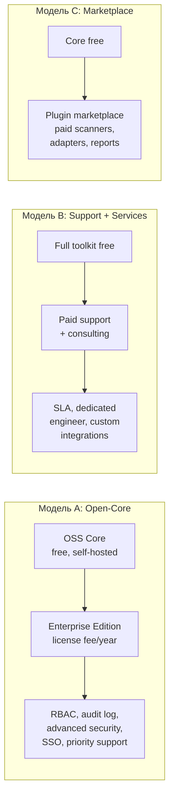
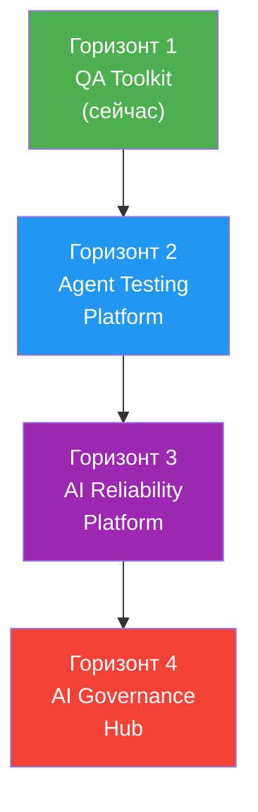
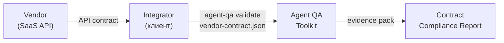
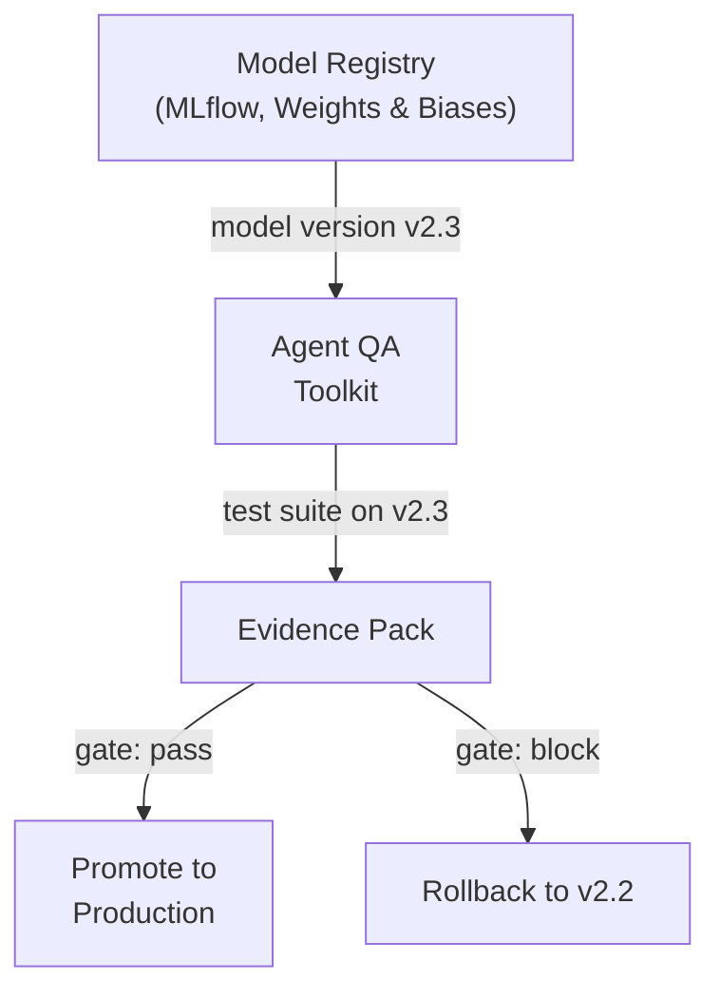
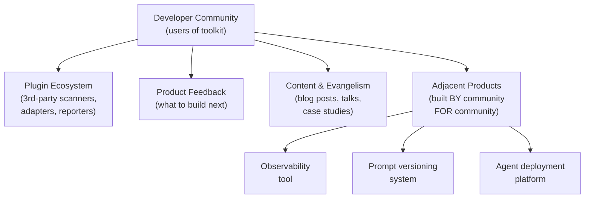
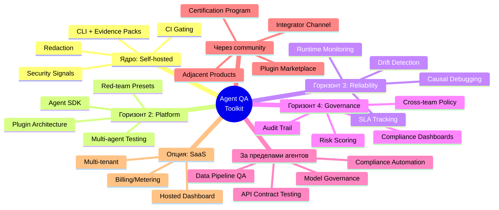

# Agent QA Toolkit: стратегическое видение

> Self-hosted ядро → платформа → экосистема

---

## 1. Почему self-hosted — не ограничение, а стратегический якорь

### Рыночный контекст

Рынок AI-агентов: $8.3B (2025) → $52.6B (2030), CAGR 45%. По прогнозам Gartner, к 2026 AI-агенты встроены в 80% enterprise-приложений. При этом **>40% agentic AI проектов могут быть свёрнуты** к 2027 из-за проблем с governance, security и trust.

Это создаёт парадокс: **агенты внедряются быстрее, чем компании готовы их контролировать**. Кто решит проблему контроля — займёт стратегическую позицию.

### Почему self-hosted выигрывает

| Фактор | SaaS-first | Self-hosted-first |
|--------|-----------|-------------------|
| **Trust** | "Ваши agent traces на нашем сервере" — барьер для enterprise | Данные не покидают инфраструктуру — нулевой барьер доверия |
| **Compliance** | GDPR/SOC2/ISO 42001 требуют аудита всей цепочки | Клиент сам контролирует цепочку |
| **Time-to-value** | Регистрация → онбординг → продажа | `docker-compose up` → работает |
| **Lock-in** | Зависимость от vendor SLA | Код у клиента навсегда |
| **Unit economics** | Infracost = your problem | Infracost = customer's problem |

**Примеры успеха self-hosted-first:**
- **GitLab** — self-hosted → hosted → IPO ($14B)
- **Grafana** — OSS core → Grafana Cloud → доминирование в observability
- **Mattermost** — self-hosted Slack → enterprise ($300M+ valuation)
- **n8n** — self-hosted automation → cloud → $60M funding

**Формула**: Open-core self-hosted → bottom-up adoption → enterprise contracts → optional SaaS later.

---

## 2. SaaS — одна из опций, не единственный путь

SaaS может появиться позже, но **не обязательно должен**.

### Три модели монетизации без SaaS



| Модель | Когда подходит | Revenue ceiling |
|--------|---------------|----------------|
| **A: Open-Core** | Есть чёткое enterprise/individual разделение фич | $5-50M ARR |
| **B: Support** | Высокая complexity, клиентам нужна помощь с деплоем | $1-10M ARR |
| **C: Marketplace** | Развитая экосистема плагинов, 3rd-party developers | $10-100M ARR |

### Когда SaaS имеет смысл

SaaS появляется, если:
1. Стартапы (2-5 чел.) не хотят деплоить Docker-инфраструктуру
2. Появляется спрос на **hosted dashboard** с shared access
3. Юнит-экономика показывает, что managed infra маржинальнее лицензий

**Решение**: SaaS строится поверх того же Helm chart, что self-hosted. Архитектурно — одна кодовая база, deployment target варьируется.

---

## 3. Органическое развитие продукта: 4 горизонта



### Горизонт 1: QA Toolkit (сейчас → 6 мес.)

> CLI для regression testing AI-агентов

- Evidence packs, CI gating, RCA
- Regex security + basic redaction
- Self-hosted, single-tenant
- **Ценность**: "Я вижу, что сломалось между версиями"

### Горизонт 2: Agent Testing Platform (6-18 мес.)

> Полноценная платформа для тестирования, а не просто CLI

Новые возможности:

| Фича | Что даёт |
|------|---------|
| **Plugin architecture** | Подключаемые security scanners, assertion engines, report formats |
| **Agent SDK** (Python/TS) | Адаптеры для LangChain, CrewAI, AutoGen, Semantic Kernel |
| **Multi-agent testing** | Тестирование взаимодействий между агентами, а не только одного |
| **Scenario builder** | DSL или UI для описания multi-step test scenarios |
| **Continuous regression** | Scheduled runs + drift detection (поведение агента изменилось?) |
| **Red-team presets** | Готовые наборы adversarial cases (injection, jailbreak, data exfil) |

- **Ценность**: "Я могу тестировать любого агента в любом сценарии, автоматически"

### Горизонт 3: AI Reliability Platform (18-36 мес.)

> От тестирования → к обеспечению надёжности в production

Новые возможности:

| Фича | Что даёт |
|------|---------|
| **Runtime monitoring** | Canary detection: агент начал вести себя иначе в production |
| **Incident replay** | Воспроизведение production incident'а в test environment |
| **Causal debugging** | "Вот tool_call #3, который привёл к ошибке в #7" |
| **SLA tracking** | Метрики надёжности агента: uptime, accuracy, safety score |
| **Policy engine** | "Если PII confidence > 0.8, gate = block" — declarative rules |
| **A/B testing для агентов** | Сравнение двух версий prompt/model на одном test suite |

- **Ценность**: "Мой агент надёжен, и я могу это доказать"

### Горизонт 4: AI Governance Hub (36+ мес.)

> Центр управления AI compliance для организации

| Фича | Что даёт |
|------|---------|
| **Compliance dashboards** | Готовые отчёты для ISO 42001, EU AI Act, SOC 2 |
| **Model registry integration** | Привязка evidence packs к конкретным версиям модели |
| **Cross-team governance** | Единые policy rules для всех AI-команд в организации |
| **Audit trail** | Immutable history: кто, когда, что тестировал, какой вердикт |
| **Risk scoring** | Агрегированная оценка рисков по всем агентам организации |

- **Ценность**: "Наша организация контролирует все AI-агенты из одного места"

---

## 4. Развитие вместе с эволюцией агентов

AI-агенты не стоят на месте. Каждый новый тип агента = новая поверхность для тестирования = новый рынок.

### Тренды и как продукт растёт с ними

| Тренд 2025-2027 | Что это | Новая потребность в тестировании |
|-----------------|---------|-------------------------------|
| **Multi-agent orchestration** | Специализированные агенты работают в команде | Тестирование **взаимодействий**: agent A → agent B → agent C, кто виноват в ошибке? |
| **Computer Use Agents** (CUA) | Агенты управляют браузером, десктопом | Тестирование **UI-actions**: клик → скриншот → результат. Evidence = видеозапись |
| **Long-running autonomous agents** | Агенты работают часами/днями без участия человека | **Drift detection**: агент через 4 часа начал игнорировать policy. Нужен continuous monitoring |
| **Agentic RAG** | Агент сам решает, что/когда/как retrieve | Тестирование **retrieval quality + injection в retrieved docs** |
| **Multi-modal agents** | Текст + изображения + audio + video | Evidence packs должны хранить **binary artifacts** (скриншоты, audio samples) |
| **Agent-to-agent protocols** | MCP, A2A (Google), стандартизация agent APIs | Тестирование **protocol compliance** — agent отвечает по спецификации? |

### Конкретные продуктовые ответы

**Multi-agent systems** → модуль `orchestration-test`:
```
Test: "Agent-planner передаёт задачу agent-executor"
Assert: executor получил правильный контекст
Assert: planner не передал PII
Assert: общее время < 10s
```

**CUA (Computer Use)** → модуль `visual-regression`:
```
Test: "Agent нажимает 'Checkout' на сайте"
Assert: screenshot diff < 5% от baseline
Assert: no unexpected network requests
Evidence: screen recording .webm
```

**Long-running agents** → модуль `continuous-monitor`:
```
Schedule: every 15 min sample agent behavior
Alert: if (drift_score > threshold)
Evidence: temporal diff — "поведение в час 1 vs час 4"
```

---

## 5. Развитие за пределами агентов

Продукт строится на **universal capabilities**, которые применимы шире, чем тестирование AI-агентов.

### 5.1. Data Pipeline Validation

Evidence-pack pattern подходит для тестирования любых данных:

| Что тестируем | Формат | Ценность |
|--------------|--------|---------|
| ETL-pipeline output | JSON/CSV diff | "Выходные данные pipeline изменились после обновления dbt-model" |
| ML model predictions | Baseline vs new model | "Новая модель хуже на 3% на этом сегменте" |
| API response contracts | Schema validation + diff | "Endpoint вернул новое поле, downstream сломается" |

**Путь**: evidence packs + assertion engine + CI gating уже работают для любых JSON-данных. Нужен минимум адаптации.

### 5.2. API Contract Testing (vendor → integrator)

Self-hosted позиция открывает рынок **vendor-integrator тестирования**:



- **Vendor** публикует contract (OpenAPI schema + expected behaviors)
- **Integrator** запускает Agent QA против реального API
- **Report** показывает: что соответствует контракту, что нет
- **Ценность**: стандартизированный QA между вендором и интегратором

**Рынок**: каждая SaaS-компания с API = потенциальный vendor, каждый их клиент = потенциальный integrator.

### 5.3. Compliance Automation

Evidence packs → ready-made audit artifacts:

| Compliance Framework | Что нужно аудитору | Что даёт Toolkit |
|---------------------|-------------------|-----------------|
| **ISO 42001** (AI management) | Risk assessment, testing evidence | `gate_recommendation` + RCA + security signals |
| **EU AI Act** | Transparency, human oversight proof | Evidence packs с полным trace |
| **SOC 2** | Access logs, change management | Audit log + versioned reports |
| **Industry-specific** (HIPAA, PCI DSS) | Data handling proof | Redaction reports + PII scan results |

**Путь к монетизации**: compliance report templates как платный аддон или Enterprise feature.

### 5.4. Model Governance / MLOps Integration



- Агент привязан к конкретной версии модели
- При каждом обновлении модели → авто-прогон test suite → gate decision
- Evidence pack привязан к `model_version` + `prompt_version`
- **Ценность**: model governance становится testable и auditable

---

## 6. Developer community как платформа роста

### 6.1. Кто эти разработчики

Toolkit привлекает специфическую аудиторию — **AI Engineers** (инженеры, строящие agentic systems). Это одна из самых быстрорастущих ролей в индустрии.

| Сегмент | Кто | Где работают | Другие потребности |
|---------|------|-------------|-------------------|
| **Agent builders** | LangChain/CrewAI/AutoGen developers | Стартапы, AI labs | Observability, prompt management, deployment |
| **AI security engineers** | Red-teamers, security auditors | Enterprise, consulting | Vulnerability scanning, compliance automation |
| **MLOps engineers** | CI/CD для моделей | Any size | Model registry, experiment tracking, monitoring |
| **QA → AI QA** | Traditional QA engineers transitioning | Mid-size companies | Training, frameworks, best practices |

### 6.2. Community → product expansion



### 6.3. Стратегии развития через community

**A. Plugin marketplace (модель Grafana)**

| Тип плагина | Кто создаёт | Монетизация |
|-------------|-------------|-------------|
| Security scanner (custom PII) | Security vendors | Revenue share |
| Agent adapter (CrewAI, AutoGen) | Framework maintainers | Free (growth) |
| Report template (ISO 42001) | Compliance consultants | Paid plugins |
| CI integration (Bitbucket, Azure DevOps) | Community | Free |

**B. Certification program (модель Kubernetes)**
- "Certified Agent QA Engineer" → обучение best practices
- Training materials → paid course ($199-499)
- Consulting network → certified partners получают leads
- **Ценность**: создаёт профессию "AI agent testing", привязанную к toolkit

**C. Integrator Channel (модель Terraform/Hashicorp)**
- System integrators (Accenture, Deloitte) используют Toolkit для AI compliance проектов
- Toolkit = инструмент в арсенале консультанта
- **Ценность**: каждый enterprise-проект интегратора = deployment тулкита
- Монетизация: Enterprise лицензия per deployment

**D. Adjacent products (модель Vercel → Next.js → v0)**

Контакты с разработчиками определённого направления позволяют валидировать и запускать **смежные продукты**:

| Adjacent product | Почему через нас | Path |
|-----------------|-----------------|------|
| **Agent Observability** | User: "Я тестирую с Agent QA, но в production нет мониторинга" | Continuous monitoring module |
| **Prompt Version Control** | User: "Мне нужен git для промптов с привязкой к test results" | Prompt registry + test evidence linking |
| **Agent Deployment Pipeline** | User: "Agent QA → gate pass → auto-deploy" | Deployment integration (ArgoCD, FluxCD) |
| **Security Audit-as-a-Service** | User: "Проведите security assessment наших агентов" | Managed red-team service using toolkit |

---

## 7. Карта развития: все направления



### Развитие по timeline

| Период | Фокус | Revenue model | Target clients |
|--------|-------|---------------|---------------|
| **Сейчас → 6 мес** | Ядро: CLI, evidence, security plugins, Helm chart | Free + Enterprise license | Early adopters, AI teams |
| **6-18 мес** | Platform: SDK, multi-agent, scenario builder | Open-core (OSS + Enterprise) | Стартапы, mid-market |
| **18-36 мес** | Reliability + первые adjacent products | Enterprise license + consulting | Enterprise AI teams |
| **36+ мес** | Governance Hub + marketplace + возможно SaaS | Platform fees + marketplace cut | Large enterprise, SI partners |

---

## 8. Ключевые принципы стратегии

1. **Self-hosted = trust moat.** Не отдавать это преимущество ради быстрого revenue
2. **Extensibility > features.** Plugin architecture важнее, чем 100 встроенных фич
3. **Evidence pack = universal format.** Это не "QA артефакт", а стандарт для AI accountability
4. **Community first, sales second.** Сначала 1000 активных CLI users, потом enterprise deals
5. **Agent-agnostic.** Не привязываться к LangChain/CrewAI — тестировать любого агента через стандартный контракт
6. **Adjacent products = validated by community.** Не гадать, что строить — спрашивать тех, кто уже использует toolkit
7. **SaaS — когда рынок попросит, не раньше.** Helm chart для enterprise → managed Helm → hosted option — естественная эволюция, не стартовая позиция
