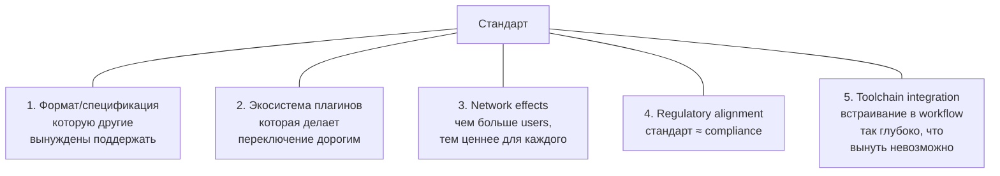
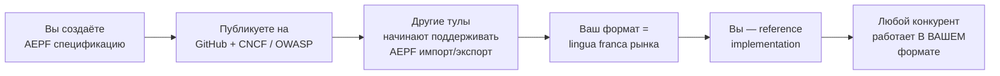
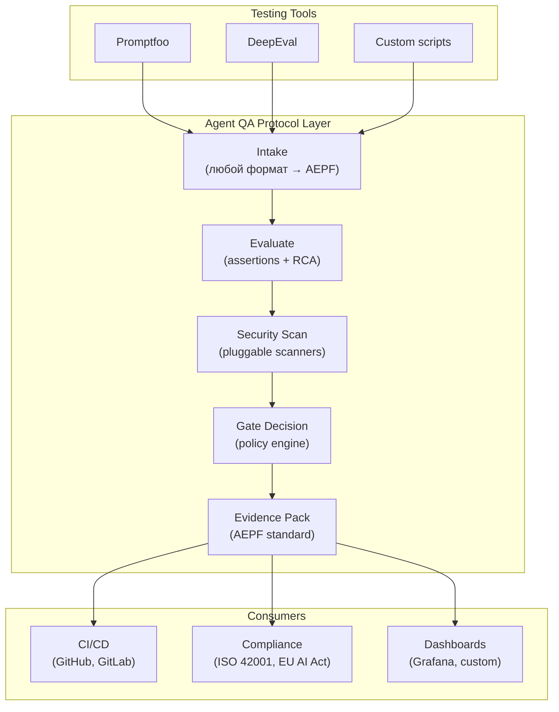
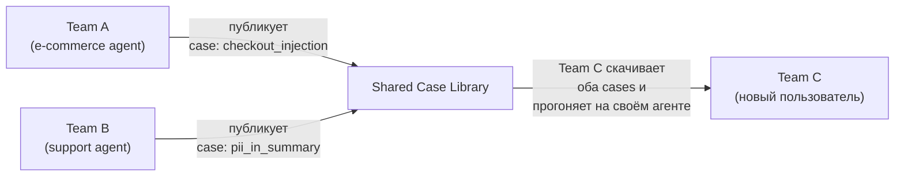
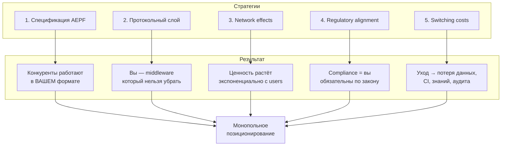

# Как стать стандартом рынка: стратегия монопольного позиционирования

---

## Как создавались стандарты: 7 прецедентов

| Продукт | Стал стандартом чего | Ключевой механизм | Сколько заняло |
|---------|---------------------|-------------------|---------------|
| **Docker** | Контейнеризация | Формат образа стал OCI-спецификацией. Невозможно делать контейнеры "не по-Docker'овски" | 2 года |
| **Kubernetes** | Оркестрация | CNCF foundation + каждый облачный провайдер внедрил managed K8s | 3 года |
| **Terraform** | IaC | Provider ecosystem: 3000+ провайдеров = тебе НУЖЕН Terraform, потому что все остальные уже через него работают | 4 года |
| **Stripe** | Платежи для разработчиков | API настолько хорош, что стал де-факто стандартом реализации. "Stripe-like API" = комплимент | 3 года |
| **Grafana** | Observability dashboards | Data source plugins: подключается ко всему → нет смысла писать свой dashboard | 4 года |
| **JUnit** | Тестирование (Java) | Формат отчёта JUnit XML стал universal test report format для CI. Даже не-Java тулы генерят JUnit XML | 5+ лет |
| **Swagger → OpenAPI** | Описание API | Спецификация пережила продукт. OpenAPI Spec используют все — даже конкуренты Swagger'а | 4 года |

### 5 паттернов, которые создают стандарт



---

## Стратегия 1: Владеть спецификацией

> *"Не тот владеет рынком, кто пишет лучший код. А тот, кто пишет формат файла."*

### Что делать

**Создать открытую спецификацию: Agent Evidence Pack Format (AEPF)**

Сейчас evidence pack — внутренний формат вашего toolkit. Нужно превратить его в **открытый стандарт**, который другие инструменты обязаны поддерживать.

| Элемент спецификации | Что описывает |
|---------------------|--------------|
| `aepf-manifest.json` | Структура evidence pack: файлы, metadata, версии |
| `aepf-case.json` | Формат test case (input, expected, metadata) |
| `aepf-result.json` | Формат результата (assertion, RCA, security signals) |
| `aepf-gate.json` | Gate recommendation schema |
| `aepf-security.json` | Security signals taxonomy |

### Как это создаёт монополию



**Прецеденты:**
- JUnit XML → все CI системы читают JUnit XML. JUnit = стандарт, даже если ты не на Java
- OpenAPI Spec → создан Swagger, но теперь все (Postman, Insomnia, Stoplight) работают с OpenAPI
- OCI Image Spec → создан Docker, теперь Podman/containerd работают с OCI

### Конкретные шаги

1. **Формализовать текущий v5 report contract как спецификацию** — JSON Schema + описание на GitHub
2. **Назвать стандарт** — "AEPF" или "Agent Evidence Protocol"
3. **Опубликовать RFC** — на GitHub Discussions, DEV.to, AI engineering newsletters
4. **Написать конвертеры** для конкурентов: `promptfoo → AEPF`, `deepeval → AEPF`
5. **Предложить в OWASP AI Exchange** как рекомендуемый формат evidence pack для AI testing
6. **Предложить маппинг на NIST AI RMF** — AEPF artifacts = evidence для TEVV (Testing, Evaluation, Verification, Validation)

---

## Стратегия 2: Стать протокольным слоем

> *Не конкурировать с инструментами — стать инфраструктурой, через которую они работают.*

### Текущая проблема рынка

У разработчиков AI-агентов сейчас:
- **Тестирование** — Promptfoo, DeepEval, кастомные скрипты
- **Observability** — LangSmith, Arize, Langfuse
- **Security** — ручное, regex, разрозненные сканеры
- **CI gating** — у каждого свой `if score < 0.8: fail` в bash

**Никто не связывает это воедино.** Нет единого pipeline: test → evaluate → gate → evidence → audit.

### Что делать

Стать **слоем, который связывает** все инструменты:



### Как это создаёт lock-in

- Инструменты тестирования экспортируют в AEPF
- CI системы читают AEPF gate decision
- Compliance tools используют AEPF evidence packs
- **Вы — посередине**. Убрать вас = переделать все интеграции

---

## Стратегия 3: Network effects через shared data

### Почему сетевой эффект = монополия

Продукт без сетевого эффекта: `ценность = f(фичи)`.
Продукт с сетевым эффектом: `ценность = f(фичи × N_users)`.

Конкурент с лучшими фичами, но без userbase, проигрывает.

### Как создать network effects в QA toolkit

| Механизм | Как работает | Пример |
|----------|-------------|--------|
| **Shared test case library** | Пользователи публикуют test cases. Чем больше кейсов — тем ценнее toolkit для новых пользователей | Как npm registry: ценность Node.js = кол-во пакетов |
| **Anonymized benchmark index** | Агрегированные (анонимные) security signals: "78% агентов в e-commerce уязвимы к injection X" | Как Have I Been Pwned: коллективная безопасность |
| **Plugin marketplace** | 3rd-party scanners, adapters, report templates. Каждый плагин увеличивает ценность платформы | Как Grafana dashboards: community-contributed |
| **Agent leaderboard** | Публичный бенчмарк: "GPT-4o + LangChain на нашем test suite: safety score 87/100" | Как HuggingFace Open LLM Leaderboard |

### Shared test case library — детально



- **Вход бесплатный**: опубликуй 1 case → получи доступ ко всем
- **Курирование**: verified cases, community votes, difficulty rating
- **Self-hosted compatible**: sync library ↔ local copy, работает offline

**Стратегическая ценность**: через 1 год — 5000 cases. Конкурент может написать лучший evaluator, но **не может скопировать 5000 community-created test cases**.

---

## Стратегия 4: Regulatory alignment = становишься compliance

### Почему это монопольно

Когда регулятор говорит "необходимо предоставить evidence of AI testing":
- Если ваш формат — это то, что compliance consultants рекомендуют → **вы необходимы по закону**
- Switching cost = risk of non-compliance

### Конкретные действия

| Регулятор / Стандарт | Ваше действие | Результат |
|---------------------|--------------|----------|
| **OWASP AI Testing Guide** (вышел Nov 2025) | Стать contributor. Маппинг AEPF → OWASP checks | Ваш формат = рекомендованный для OWASP testing |
| **NIST AI RMF 2.0** | Маппинг evidence packs → TEVV artifacts. Публикация whitepaper | "Agent QA Toolkit — NIST-compatible TEVV" |
| **ISO 42001** (AI Management) | Шаблоны evidence pack для ISO 42001 сертификации | Консультанты рекомендуют ваш toolkit для подготовки |
| **EU AI Act** | Risk assessment reports на основе gate_recommendation + security signals | Toolkit как инструмент демонстрации compliance |

### Как это работает на практике

```
Компания хочет сертификацию ISO 42001
  → Консультант: "Покажите evidence тестирования AI"
    → Компания: "У нас Agent QA evidence packs"
      → Консультант: "Мы знаем этот формат, принято"
        → Компания НИКОГДА не перейдёт на другой инструмент
```

---

## Стратегия 5: Switching cost = максимальный

### Что создаёт switching cost

| Тип lock-in | Как создать | Стоимость переключения |
|------------|-----------|----------------------|
| **Data lock-in** | Все evidence packs = AEPF → конвертация при уходе | Высокая (годами накопленные данные) |
| **Workflow lock-in** | CI pipeline настроен на `agent-qa gate` command | Средняя (переписать CI) |
| **Knowledge lock-in** | Команда обучена на Agent QA → сертификация | Высокая (переобучение) |
| **Ecosystem lock-in** | Плагины, кастомные scanners, report templates | Высокая (переписать плагины) |
| **Compliance lock-in** | Аудитор принимает AEPF → смена инструмента = новый аудит | Очень высокая |
| **Network lock-in** | Shared test cases, benchmarks → нет аналога у конкурента | Максимальная |

### Формула монопольного отрыва

```
Отрыв = Switching_Cost × Network_Effects × Regulatory_Alignment
```

- **Switching Cost** растёт с каждым evidence pack, плагином, CI интеграцией
- **Network Effects** растут с каждым shared test case, каждым plugin
- **Regulatory Alignment** = один раз войдя в OWASP/NIST — оттуда не вытеснят

---

## Тактический план: 18 месяцев до стандарта

### Q1 (месяцы 1-3): Основа стандарта

| Действие | Зачем |
|----------|-------|
| Формализовать AEPF spec v1.0 (JSON Schema + docs) | Без спецификации нет стандарта |
| Опубликовать spec на GitHub под Apache 2.0 | Открытость = доверие |
| Написать конвертеры: Promptfoo → AEPF, DeepEval → AEPF | Показать: "ваш инструмент уже совместим" |
| Подать предложение в OWASP AI Exchange | Начать regulatory alignment |
| Написать GitHub Action: `agent-qa/gate-action` | CI integration = workflow lock-in |
| Запустить 3-5 early adopters на реальных агентах | Валидация формата на реальных данных |

### Q2 (месяцы 4-6): Экосистема

| Действие | Зачем |
|----------|-------|
| Plugin SDK + первые 5 плагинов (Presidio, TruffleHog, LLM Guard, custom scanner template) | Ecosystem lock-in |
| Shared test case library (seed с 200+ cases) | Network effects |
| Agent SDK: Python + TypeScript (LangChain, CrewAI adapters) | Снизить barrier to entry |
| AEPF → NIST AI RMF mapping whitepaper | Compliance positioning |
| Публикации: DEV.to, AI Engineering newsletter, 2 conference talks | Brand awareness |

### Q3 (месяцы 7-9): Network effects

| Действие | Зачем |
|----------|-------|
| Shared case library: 1000+ cases, community curation | Critical mass |
| Anonymized security benchmark: "State of Agent Security 2026" report | Thought leadership + data network effect |
| Первые 2-3 compliance consultants рекомендуют AEPF | Regulatory moat |
| Integration partners: 3-5 AI tooling vendors поддерживают AEPF export | Protocol layer positioning |
| GitLab CI / Azure DevOps templates (не только GitHub) | Expand CI coverage |

### Q4-Q6 (месяцы 10-18): Закрепление

| Действие | Зачем |
|----------|-------|
| AEPF spec v2.0 (multi-agent, visual evidence, streaming) | Evolve standard faster than competitors |
| Certification program: "Certified Agent QA Professional" | Knowledge lock-in |
| OWASP AI Testing Guide integration (if accepted) | Regulatory monopoly |
| Enterprise Helm chart + air-gapped mode | Enterprise adoption |
| Agent leaderboard (публичные бенчмарки) | Network effect + brand |
| 50+ plugins in marketplace | Ecosystem moat |

---

## Что даёт каждая стратегия



## Главный принцип

> **Не строить лучший инструмент. Строить формат, в котором работает весь рынок.**

Docker не лучший в контейнеризации. JUnit не лучший тест-фреймворк. OpenAPI не лучший описатель API. Но они — **стандарты**, потому что владеют форматом, экосистемой и switching cost.

Agent QA Toolkit должен стать **не лучшим тулом для тестирования агентов**, а **форматом, в котором индустрия хранит и обменивается evidence тестирования AI**.
