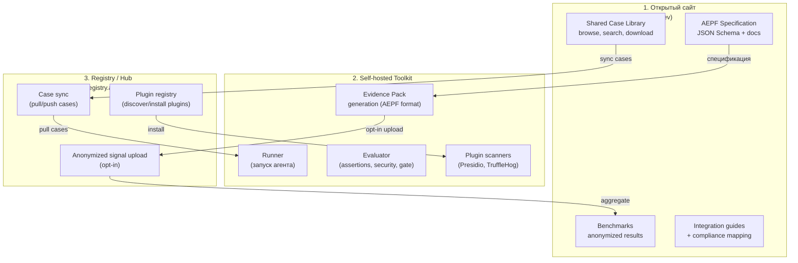

# AEPF: Gap-анализ полей и архитектурный сплит

---

## 1. Что уже покрыто — полная карта

### Уровень: Evidence Pack (compare-report.json)

| Область | Поля | Статус |
|---------|------|--------|
| **Идентификация** | `contract_version`, `report_id` | ✅ есть |
| **Источники** | `baseline_dir`, `new_dir`, `cases_path` | ✅ есть |
| **Воспроизводимость** | `repro.bundle_manifest_href`, `how_to_reproduce_href` | ✅ есть |
| **Summary** | pass/fail counts, regressions, improvements | ✅ есть |
| **Root cause** | `root_cause_breakdown` (7 классов) | ✅ есть |
| **Quality** | `transfer_class`, `redaction_status`, `redaction_preset_id` | ✅ есть |
| **Security summary** | severity counts, top signal kinds, per-suite | ✅ есть |
| **Risk** | `risk_summary`, `cases_requiring_approval`, `cases_block_recommended` | ✅ есть |
| **Data coverage** | total, emitted, missing/broken per side | ✅ есть |
| **Quality flags** | self_contained, portable_paths, missing_assets, path_violations, large_payloads | ✅ есть |
| **Suite breakdown** | `summary_by_suite` с полным набором полей | ✅ есть |

### Уровень: Item (per-case)

| Область | Поля | Статус |
|---------|------|--------|
| **Идентификация** | `case_id`, `title`, `suite` | ✅ есть |
| **Статус** | `case_status`, `case_status_reason` | ✅ есть |
| **Результат** | `baseline_pass`, `new_pass`, `baseline_root`, `new_root` | ✅ есть |
| **Policy** | `preventable_by_policy`, `recommended_policy_rules` | ✅ есть |
| **Доступность** | `data_availability.{baseline,new}.{status,reason,reason_code,details}` | ✅ есть |
| **Trace integrity** | `trace_integrity.{baseline,new}.{status,issues}` | ✅ есть |
| **Security signals** | `security.{baseline,new}.signals[]` с kind/severity/confidence/title/details/evidence_refs | ✅ есть |
| **Gate** | `risk_level`, `risk_tags`, `gate_recommendation` | ✅ есть |
| **Failure** | `failure_summary.{baseline,new}.{class,http_status,timeout_ms,attempts}` | ✅ есть |
| **Artifacts** | hrefs + manifest keys для case responses, failure body/meta, replay diff, run meta | ✅ есть |

### Уровень: SecuritySignal

| Поле | Что содержит | Статус |
|------|-------------|--------|
| `kind` | 11 типов: untrusted_url, token_exfil, policy_tampering, unexpected_outbound, high_risk_action, permission_change, secret_in_output, pii_in_output, prompt_injection, runner_failure, unknown | ✅ есть |
| `severity` | low / medium / high / critical | ✅ есть |
| `confidence` | low / medium / high | ✅ есть |
| `title` | Human-readable | ✅ есть |
| `details` | tool, call_id, action_id, fields, urls, notes | ✅ есть |
| `evidence_refs` | kind + manifest_key | ✅ есть |

### Уровень: AgentResponse (input)

| Поле | Статус |
|------|--------|
| `case_id`, `version`, `workflow_id` | ✅ |
| `final_output` (text/json) | ✅ |
| `events[]` (tool_call, tool_result, retrieval, final_output) | ✅ |
| `proposed_actions[]` (с risk_level, risk_tags, evidence_refs) | ✅ |
| `runner_failure` (class, network details, body, latency) | ✅ |

---

## 2. Что НЕ покрыто — gaps для стандарта

### 2.1. Metadata layer (кто/когда/чем тестировал)

**Проблема**: report знает *что* тестировалось, но не знает *кто*, *когда*, *в каком окружении*, *какой версией toolkit*. Для стандарта это критично — evidence pack без metadata бесполезен для аудита.

```json
// ❌ Не существует. Нужно добавить:
{
  "metadata": {
    "toolkit_version": "1.2.0",
    "spec_version": "aepf-v1",
    "generated_at": "2026-02-15T13:00:00Z",
    "generated_by": "agent-qa-evaluator",
    "run_id": "run_abc123",
    "organization_id": "org_optional",
    "labels": { "team": "platform", "env": "staging" },
    "ttl_days": 90
  }
}
```

| Поле | Зачем |
|------|-------|
| `toolkit_version` | Воспроизводимость: "этот report сгенерирован версией X" |
| `spec_version` | Совместимость: "этот pack соответствует AEPF v1" |
| `generated_at` | Аудит: timestamp |
| `run_id` | Связка: runner run → evaluator report |
| `organization_id` | Multi-team governance |
| `labels` | Фильтрация, поиск, категоризация |
| `ttl_days` | Data retention policy |

### 2.2. Environment context (что тестировалось)

**Проблема**: report не привязан к конкретной версии агента, модели или prompt'а. Для regression testing критично знать **между чем и чем** сравнение.

```json
// ❌ Не существует. Нужно добавить:
{
  "environment": {
    "agent": {
      "name": "support-agent-v2",
      "version": "2.3.1",
      "endpoint": "http://agent:8080/run",
      "framework": "langchain",
      "framework_version": "0.2.5"
    },
    "model": {
      "provider": "openai",
      "model_id": "gpt-4o-2025-01-15",
      "temperature": 0.7,
      "max_tokens": 4096
    },
    "prompt_version": "prompt-v3.2",
    "deployment": {
      "env": "staging",
      "region": "eu-west-1",
      "commit_sha": "abc123f"
    }
  }
}
```

### 2.3. Assertion results (детальные проверки)

**Проблема**: `EvaluationResult` содержит `assertions[]` с name/pass/details, но это **не попадает в compare-report.json**. Report хранит только `baseline_pass` / `new_pass` — boolean. Потеря: **какие именно assertions сломались**.

```json
// ❌ Не в compare-report. Нужно пробросить:
{
  "items[].assertions": [
    { "name": "action_required", "pass": true, "details": { "expected": ["refund"], "found": ["refund"] } },
    { "name": "must_include", "pass": false, "details": { "expected": ["tracking_number"], "found": [] } },
    { "name": "json_schema", "pass": true }
  ]
}
```

### 2.4. Security signals — расширение taxonomy

**Текущие 11 kinds** покрывают основное, но для стандарта нужны дополнительные:

| Новый kind | Зачем | Пример |
|-----------|-------|--------|
| `data_exfiltration` | Агент отправил данные на внешний endpoint | tool_call к неизвестному API с user data |
| `hallucination_in_output` | Агент сгенерировал несуществующие данные | Ссылка на несуществующий заказ |
| `excessive_permissions` | Агент запросил больше прав, чем нужно | `admin:write` когда нужен `read` |
| `unsafe_code_execution` | Агент выполнил или предложил код | `eval()`, SQL без параметризации |
| `bias_detected` | Детекция предвзятости в ответе | Дискриминация по demographic |
| `compliance_violation` | Нарушение policy правила | Ответ без disclamer когда требуется |
| `model_refusal` | Модель отказалась отвечать | "I cannot help with that" |
| `context_poisoning` | Вредоносные данные в retrieved documents | Injection через RAG docs |

### 2.5. Compliance mapping

**Проблема**: нет связки evidence → compliance framework requirement. Для аудитора нужно знать: "этот evidence pack закрывает пункт X.Y стандарта Z".

```json
// ❌ Не существует. Нужно добавить:
{
  "compliance": {
    "frameworks": ["ISO_42001", "NIST_AI_RMF"],
    "mappings": [
      { "framework": "ISO_42001", "clause": "8.4", "description": "AI system testing", "covered_by": ["assertions", "security_signals"] },
      { "framework": "NIST_AI_RMF", "function": "MEASURE", "category": "2.6", "covered_by": ["trace_integrity", "gate_recommendation"] }
    ]
  }
}
```

---

## 3. Сводная таблица покрытия

| Категория | Текущее покрытие | Стандарт ожидает | Gap |
|-----------|-----------------|-----------------|-----|
| **Результаты тестирования** | ✅ pass/fail, RCA, gate | ✅ | — |
| **Security signals** | ✅ 11 kinds | 19+ kinds | +8 kinds |
| **Trace integrity** | ✅ ok/partial/broken | ✅ | — |
| **Evidence mapping** | ✅ manifest + sha256 | ✅ | — |
| **Redaction** | ✅ status + summary | ✅ | — |
| **Portability** | ✅ relative paths, offline | ✅ | — |
| **Quality flags** | ✅ self-contained, portable | ✅ | — |
| **Suite breakdown** | ✅ per-suite stats | ✅ | — |
| **Metadata** | ❌ нет toolkit/spec version | Обязательно | **Critical** |
| **Environment** | ❌ нет agent/model/prompt info | Обязательно | **Critical** |
| **Detailed assertions** | ❌ не в report JSON | Должны быть | **High** |
| **Compliance mapping** | ❌ нет | Для enterprise | **Medium** |
| **Timing / latency** | ⚠️ есть в events, нет в summary | Для benchmarking | **Low** |
| **Multi-agent context** | ❌ нет | Для будущего | **Low** |

**Оценка**: ~75% покрытие. Для spec v1 critical gaps — metadata и environment.

---

## 4. Архитектурный сплит: 3 инструмента

Да, вы правильно понимаете — нужно **разделение на 3 компонента**:



### Что каждый компонент делает

| # | Компонент | Тип | Что делает | Монетизация |
|---|-----------|-----|-----------|-------------|
| **1** | **aepf.dev** (открытый сайт) | Public, бесплатный | Спецификация, документация, shared cases, бенчмарки, compliance mappings | Нет (бесплатный = adoption) |
| **2** | **agent-qa toolkit** (self-hosted) | Основной продукт | Runner + Evaluator + Plugins → генерация AEPF evidence packs | Open-core: OSS core + Enterprise license |
| **3** | **registry.aepf.dev** (hub) | Optional, гибрид | Синхронизация cases, plugin registry, анонимные бенчмарки | Freemium: free sync + paid private registries |

### Как они взаимодействуют

```
Пользователь:
1. Читает спецификацию на aepf.dev
2. Ставит toolkit: `docker-compose up` (self-hosted)
3. Подключает cases из registry: `agent-qa pull-cases security/injection-suite`
4. Запускает тесты: `agent-qa run --cases ./cases`
5. Генерирует evidence pack в AEPF формате
6. (opt-in) Публикует anonymized results в registry
7. Показывает evidence pack аудитору → compliance mapping из спецификации
```

### Третий инструмент — Registry

Это **не** полноценный SaaS. Это lightweight сервис:

| Функция | Как работает | Аналог |
|---------|-------------|--------|
| **Case sync** | CLI: `pull-cases`, `push-cases` | npm registry |
| **Plugin registry** | CLI: `install-plugin presidio-scanner` | Grafana plugin catalog |
| **Anonymized benchmarks** | Opt-in upload, aggregation, public dashboard | HuggingFace leaderboard |
| **Case search** | Web UI: "injection cases for e-commerce agents" | Docker Hub search |

**Стек**: минимальный — static site (Astro/Next) + API (Cloudflare Workers / Deno Deploy) + storage (R2/S3). Можно запустить за 2-4 недели.

### Зависимости между компонентами

```
aepf.dev ← НЕ зависит ни от чего (чистые docs + spec)
toolkit  ← зависит от spec (генерирует AEPF-compliant packs)
registry ← зависит от spec (хранит cases/plugins по AEPF schema)

toolkit  ↔ registry: OPTIONAL sync (работает полностью offline без registry)
```

> **Ключевой принцип**: toolkit ДОЛЖЕН работать на 100% без registry (air-gapped mode). Registry — value-add, не dependency.

---

## 5. Приоритеты: что делать первым

| Приоритет | Действие | Зачем |
|-----------|---------|-------|
| **P0** | Добавить `metadata` в compare-report | Без этого report бесполезен для аудита |
| **P0** | Добавить `environment` в compare-report | Без привязки к agent/model — нет reproducibility |
| **P0** | Опубликовать AEPF spec v1 JSON Schema на GitHub | Стандарт начинается со спецификации |
| **P1** | Пробросить `assertions[]` в items | Потеря данных = потеря ценности |
| **P1** | Развернуть aepf.dev (static site со spec + docs) | Публичная точка входа |
| **P2** | Расширить security signal taxonomy (+8 kinds) | Полнота детекции |
| **P2** | Запустить registry с case sync | Network effects |
| **P3** | Добавить compliance mapping | Enterprise ценность |
| **P3** | Добавить multi-agent context fields | Будущий рынок |
