# aepf.dev: полная спецификация сайта

> Публичное лицо стандарта: спецификация, каталог, документация

---

## 1. Назначение и аудитория

| Аудитория | Что ищут на сайте | Конверсия |
|-----------|------------------|-----------|
| **AI Engineer** | "Как тестировать моего агента?" | Скачать toolkit, взять cases |
| **Security Engineer** | "Как проверить агента на injection/PII?" | Использовать security case packs |
| **Compliance Officer** | "Как доказать тестирование AI для ISO 42001?" | Compliance mapping, evidence pack format |
| **Tool Developer** | "Как интегрировать мой сканер?" | Спецификация, plugin API |
| **Evaluator / Analyst** | "Как агенты в среднем по рынку?" | Leaderboard, benchmarks |

**Главная задача сайта**: убедить, что AEPF — стандарт, которому стоит следовать, и дать все ресурсы для начала работы.

---

## 2. Карта страниц

```mermaid
graph TB
    Home["/ <br/>Главная"] --> Spec["/spec<br/>Спецификация"]
    Home --> Cases["/cases<br/>Case Library"]
    Home --> Plugins["/plugins<br/>Plugin Catalog"]
    Home --> Docs["/docs<br/>Документация"]
    Home --> Leaderboard["/leaderboard<br/>Benchmarks"]
    Home --> Blog["/blog<br/>Блог / Research"]
    Home --> Compliance["/compliance<br/>Compliance Mapping"]
    
    Spec --> SpecCase["/spec/case"]
    Spec --> SpecResult["/spec/result"]
    Spec --> SpecSignal["/spec/security-signal"]
    Spec --> SpecGate["/spec/gate"]
    Spec --> SpecManifest["/spec/manifest"]
    Spec --> SpecReport["/spec/report"]
    Spec --> SpecPack["/spec/evidence-pack"]
    Spec --> SpecMeta["/spec/metadata"]
    
    Cases --> CaseDetail["/cases/:name"]
    Plugins --> PluginDetail["/plugins/:name"]
    Docs --> QuickStart["/docs/quickstart"]
    Docs --> Integration["/docs/integration"]
    Docs --> SelfHosted["/docs/self-hosted"]
    Docs --> ContribCases["/docs/contributing-cases"]
    Docs --> ContribPlugins["/docs/contributing-plugins"]
    
    Compliance --> ISO["/compliance/iso-42001"]
    Compliance --> NIST["/compliance/nist-ai-rmf"]
    Compliance --> EUAI["/compliance/eu-ai-act"]
    Compliance --> OWASP["/compliance/owasp-ai"]
```



---

## 3. Страницы: детальное описание

### 3.1. Главная (`/`)

**Цель**: за 10 секунд объяснить, что такое AEPF и зачем.

#### Структура

**Hero секция**:
```
Agent Evidence Pack Format (AEPF)
Открытый стандарт для тестирования, оценки
и доказательства надёжности AI-агентов.

[Читать спецификацию]  [Быстрый старт]  [GitHub]
```

**Problem / Solution (3 колонки)**:

| Проблема | Решение AEPF |
|----------|-------------|
| "Агент сломался, но непонятно что и когда" | Портативные evidence packs с trace, RCA и gate decision |
| "Каждый тестирует по-своему, результаты несовместимы" | Единый формат: run → evaluate → report (AEPF JSON) |
| "Compliance требует evidence, но нечего показать" | AEPF ↔ ISO 42001, NIST RMF, EU AI Act mapping |

**Числа (динамические, из Registry API)**:
```
[237] case packs  ·  [12] plugins  ·  [890] benchmark submissions  ·  [v1.0] spec version
```

**Как это работает (3 шага)**:
```
1. Опишите cases    →  JSON формат, совместим с любым агентом
2. Запустите toolkit →  agent-qa run → evaluate → evidence pack
3. Используйте      →  CI gate, compliance report, team review
```

**Кто использует** (логотипы / отзывы — заглушки до появления реальных):
```
"Agent QA сэкономил нам 2 недели ручного тестирования перед SOC 2 аудитом"
— CTO, fintech startup
```

**Footer CTA**:
```
Начните за 5 минут:
$ docker run aepf/agent-qa pull security/injection-v2
$ docker run aepf/agent-qa run --cases ./cases
```

---

### 3.2. Спецификация (`/spec`)

**Цель**: формальная спецификация AEPF — reference document для имплементоров.

#### Главная страница спеки

```
AEPF Specification v1.0
Status: Draft / Active
Last updated: 2026-XX-XX

Содержание:
1. Case Format           → /spec/case
2. Agent Response         → /spec/result
3. Security Signal        → /spec/security-signal
4. Gate & Risk           → /spec/gate
5. Manifest & Evidence   → /spec/manifest
6. Report (compare-report.json) → /spec/report
7. Evidence Pack Structure → /spec/evidence-pack
8. Metadata & Environment → /spec/metadata
```

**Для каждой sub-page**:
- Human-readable описание + примеры
- JSON Schema (inline + ссылка на download)
- TypeScript типы (из `shared-types`)
- Табличка: field → required/optional → type → description
- Примеры валидных и невалидных документов

#### Пример: `/spec/case` — страница спецификации test case

```markdown
## Test Case Schema

Описывает один тест для AI-агента.

### Поля

| Поле | Тип | Required | Описание |
|------|-----|----------|----------|
| `id` | string | ✅ | Уникальный ID кейса (e.g. `inj_001`) |
| `title` | string | ✅ | Человекочитаемое название |
| `input.user` | string | ✅ | Входное сообщение пользователя |
| `input.context` | any | ❌ | Дополнительный контекст |
| `expected` | object | ✅ | Ожидаемые результаты |
| `expected.action_required` | string[] | ❌ | Обязательные действия |
| `expected.tool_required` | string[] | ❌ | Обязательные tools |
| `expected.tool_sequence` | string[] | ❌ | Порядок tool calls |
| `expected.json_schema` | object | ❌ | JSON Schema для output |
| `expected.must_include` | string[] | ❌ | Строки, которые должны быть в output |
| `expected.must_not_include` | string[] | ❌ | Строки, которых НЕ должно быть |
| `expected.retrieval_required.doc_ids` | string[] | ❌ | Обязательные retrieved documents |
| `metadata.tags` | string[] | ❌ | Теги для фильтрации |
| `metadata.severity` | enum | ❌ | `low` / `medium` / `high` / `critical` |
| `metadata.kind` | string | ❌ | Тип агента: `tool_agent`, `rag_agent`, `chat_agent` |
| `suite` | string | ❌ | Suite: `correctness`, `robustness`, `security` |

### JSON Schema

[Скачать: aepf-case-v1.schema.json]

### Пример

{показать JSON пример из реальных cases.json}

### TypeScript

{показать тип Case из shared-types}
```

#### Пример: `/spec/security-signal`

```markdown
## Security Signal Schema

Описывает один security finding, обнаруженный при анализе agent response.

### Signal Kinds Taxonomy

| Kind | Severity (default) | Описание |
|------|-------------------|----------|
| `secret_in_output` | high | Маркеры секретов (API keys, tokens) в output |
| `pii_in_output` | high | PII (email, phone, SSN) в output |
| `prompt_injection_marker` | high-critical | Маркеры prompt injection |
| `untrusted_url_input` | medium | Внешние URL в output |
| `high_risk_action` | high | Unsafe tool parameters |
| `token_exfil_indicator` | critical | Индикаторы exfiltration |
| `policy_tampering` | critical | Попытка изменить policy |
| `unexpected_outbound` | medium | Неожиданные внешние запросы |
| `permission_change` | high | Изменение прав доступа |
| `runner_failure_detected` | medium-high | Сбой при запуске агента |
| `unknown` | low | Неклассифицированный signal |
```

---

### 3.3. Case Library (`/cases`)

**Цель**: browse, search, preview test case packs. Данные — из Registry API.

#### UI элементы

**Поиск + фильтры (sidebar или top bar)**:
```
[🔍 Search cases...]

Filters:
  Tags:       [security] [injection] [pii] [tool] [rag] [format]
  Agent Type: [All ▼] chat | tool_agent | rag_agent
  Difficulty: [All ▼] starter | intermediate | advanced
  Suite:      [All ▼] correctness | robustness | security
  Sort:       [Downloads ▼] | Updated | Name | Cases count
```

**Cards (grid layout)** — каждая карточка:
```
┌──────────────────────────────────┐
│ 🛡️ security/injection-v2         │
│                                  │
│ Prompt Injection Test Suite v2   │
│ 20 cases covering direct,       │
│ indirect, and multi-turn...     │
│                                  │
│ Tags: security · injection       │
│ Suite: security                  │
│ Difficulty: advanced             │
│                                  │
│ ↓ 342 downloads  ★ 28 stars     │
│ Updated: Mar 15, 2026            │
│                                  │
│ [Preview]  [Pull command]        │
└──────────────────────────────────┘
```

**Case detail page** (`/cases/:name`):
- README.md rendered
- Cases list (preview first 5, expandable)
- Для каждого case: id, title, input, expected (collapsible)
- Pull command: `agent-qa pull security/injection-v2`
- Stats: downloads, stars, submissions
- Versions: history of updates
- Author info

---

### 3.4. Plugin Catalog (`/plugins`)

**Аналогичен Case Library, но для плагинов.**

Карточка плагина:
```
┌──────────────────────────────────┐
│ 🔌 presidio-scanner              │
│                                  │
│ Microsoft Presidio PII Scanner   │
│ ML-based entity recognition      │
│                                  │
│ Type: security_scanner           │
│ Tags: pii · ml · presidio        │
│                                  │
│ Requires: presidio-analyzer      │
│ (Docker sidecar)                 │
│                                  │
│ [Install command]  [Docs]        │
└──────────────────────────────────┘
```

---

### 3.5. Документация (`/docs`)

**Структура**:

| Страница | Содержание |
|----------|-----------|
| `/docs/quickstart` | 5-минутный старт: install → pull cases → run → report |
| `/docs/integration` | Как подключить реального агента (LangChain, CrewAI, raw HTTP) |
| `/docs/self-hosted` | Docker Compose / Helm deployment guide |
| `/docs/writing-cases` | Как писать test cases: формат, assertions, best practices |
| `/docs/contributing-cases` | Как опубликовать case pack в registry |
| `/docs/contributing-plugins` | Как написать и опубликовать plugin |
| `/docs/ci-integration` | GitHub Actions, GitLab CI, Azure DevOps templates |
| `/docs/security-signals` | Подробно о каждом signal kind с примерами |
| `/docs/redaction` | Presets, custom rules, redaction-summary format |

---

### 3.6. Compliance Mapping (`/compliance`)

**Цель**: показать, как AEPF evidence packs маппятся на compliance frameworks.

#### `/compliance/iso-42001`

```
ISO/IEC 42001: AI Management System

Как AEPF покрывает требования:

| Clause | Requirement | AEPF Coverage |
|--------|------------|---------------|
| 6.1.2 | AI risk assessment | gate_recommendation + risk_level + security signals |
| 8.4   | AI system testing | Evidence packs (full trace + assertions) |
| 9.1   | Monitoring | Continuous regression runs |
| 9.2   | Internal audit | Audit-ready reports with manifest integrity |
| 10.1  | Nonconformity | root_cause + recommended_policy_rules |

[Скачать: ISO 42001 Evidence Pack Template]
```

Аналогично для NIST AI RMF, EU AI Act, OWASP AI Testing Guide.

---

### 3.7. Leaderboard (`/leaderboard`)

**Данные из Registry Benchmarks API.**

```
Agent Safety Leaderboard

Case Pack: [security/injection-v2 ▼]

Framework   | Model     | Submissions | Pass Rate (avg) | Safety Score
langchain   | gpt-4o    | 45          | 88%            | 82/100
crewai      | claude-3.5| 22          | 85%            | 79/100
autogen     | gpt-4o    | 12          | 81%            | 75/100

Percentiles (all submissions):
p25: 65%  |  p50: 80%  |  p75: 90%  |  p95: 95%

[Submit your results →]
Команда: agent-qa benchmark submit
```

---

### 3.8. Blog (`/blog`)

Контент для thought leadership:
- "State of Agent Security 2026" (на основе anonymized benchmarks)
- "How to red-team your AI agent in 10 minutes"
- "AEPF + ISO 42001: compliance guide"
- Release notes для toolkit и spec updates
- Case studies от пользователей

---

## 4. Технический стек

### Рекомендация: Astro + наш Registry API

| Компонент | Технология | Почему |
|-----------|-----------|--------|
| **Framework** | [Astro](https://astro.build) | SSG + SSR, fast, islands architecture, идеален для docs |
| **Styling** | Tailwind CSS 4 | Быстрая разработка, консистентный design system |
| **Components** | React (islands) | Интерактивные элементы: search, filters, leaderboard |
| **Markdown** | MDX | Spec pages, docs, blog posts |
| **Search** | Pagefind (static) + Registry API | Instant doc search + case/plugin search |
| **Hosting** | Cloudflare Pages / Vercel | Free tier, global CDN |
| **Analytics** | Plausible (self-hosted) | Privacy-friendly, no cookies |
| **CMS (blog)** | MDX files in repo или Keystatic | Git-based, no external dependency |

### Альтернатива: Next.js

Если у команды больше опыт с Next.js — тоже подходит. Но для docs-heavy сайта Astro объективно быстрее и проще.

---

## 5. Интеграция с Registry API

Динамические данные на сайте — из Registry:

| Страница | Endpoint | Что показываем |
|----------|---------|---------------|
| Главная (числа) | `GET /api/v1/cases` + `GET /api/v1/plugins` | Кол-во packs, plugins, submissions |
| `/cases` | `GET /api/v1/cases?q=...` | Список case packs, search, filters |
| `/cases/:name` | `GET /api/v1/cases/:name` | Детальная страница pack |
| `/plugins` | `GET /api/v1/plugins` | Каталог plugins |
| `/leaderboard` | `GET /api/v1/benchmarks/leaderboard` | Benchmark data |

**SSR или ISR**: данные обновляются каждые 5 минут (Incremental Static Regeneration) или при deploy. НЕ client-side fetch для SEO.

---

## 6. Design System

### Принципы

| Принцип | Реализация |
|---------|-----------|
| **Trust** | Строгий, профессиональный дизайн. Не "startup-яркий", а "enterprise-надёжный" |
| **Technical** | Моноширинный шрифт для кода. Syntax highlighting. Schema validation examples |
| **Fast** | Lighthouse score > 95. Minimal JS. Static-first |
| **Accessible** | WCAG 2.1 AA. Keyboard navigation. Screen reader support |

### Цветовая палитра (предложение)

```
Background:    #0B0D10 (dark) / #FFFFFF (light)
Surface:       #0F1217 / #F8F9FA
Primary:       #3B82F6 (blue — trust)
Accent:        #10B981 (green — pass) / #EF4444 (red — fail)
Text:          #E8EAED / #1A1A2E
Muted:         #9AA4B2 / #6B7280
Border:        #232836 / #E5E7EB
```

### Типографика

```
Headings:  Space Grotesk (bold, -0.02em tracking)
Body:      Inter (regular)
Code:      JetBrains Mono
```

> Эти шрифты уже используются в `htmlReport.ts` — сохраняем визуальную связность с toolkit.

---

## 7. SEO и контентная стратегия

### Target keywords

| Keyword | Страница | Intent |
|---------|---------|--------|
| `ai agent testing` | Home, Docs | Informational |
| `ai agent security testing` | Cases, Spec | Informational |
| `prompt injection testing` | Cases, Blog | Informational |
| `ai compliance testing ISO 42001` | Compliance | Commercial |
| `test ai agent CI/CD` | Docs | Informational |
| `agent evidence pack` | Spec | Branded |
| `AEPF specification` | Spec | Branded |

### Structured data

- **JSON-LD** для: SoftwareApplication (toolkit), TechArticle (spec pages), FAQPage (docs)
- **Open Graph** для шаринга в Twitter/LinkedIn
- **Sitemap.xml** автогенерация (Astro built-in)

---

## 8. Фазы разработки сайта

| Фаза | Страницы | Срок |
|------|---------|------|
| **Phase 1** | Home + Spec (все sub-pages) + Docs (quickstart, integration) | 2-3 недели |
| **Phase 2** | Cases Library + Plugin Catalog (интеграция с Registry API) | 2 недели |
| **Phase 3** | Compliance Mapping + Blog (первые 3 поста) | 1-2 недели |
| **Phase 4** | Leaderboard + advanced docs (CI, redaction, contributing) | 2-3 недели |

**Phase 1 — MVP сайта**: спецификация + quickstart. Этого достаточно для запуска стандарта.

---

## 9. Чеклист для команды

- [ ] Выбрать домен (aepf.dev / agentevidence.dev / другой)
- [ ] Развернуть Astro проект + Tailwind
- [ ] Сверстать Home page
- [ ] Создать MDX шаблон для spec pages
- [ ] Написать контент для `/spec/case`, `/spec/security-signal`, `/spec/report`
- [ ] Создать JSON Schema файлы (8 штук) и разместить для download
- [ ] Сверстать `/docs/quickstart`
- [ ] Подключить Pagefind для static search
- [ ] Настроить CI: push to main → deploy to Cloudflare Pages
- [ ] Настроить Plausible analytics
- [ ] Опубликовать спецификацию на GitHub (отдельный repo: `aepf/specification`)
- [ ] Интегрировать Registry API для `/cases` и `/plugins` (Phase 2)
