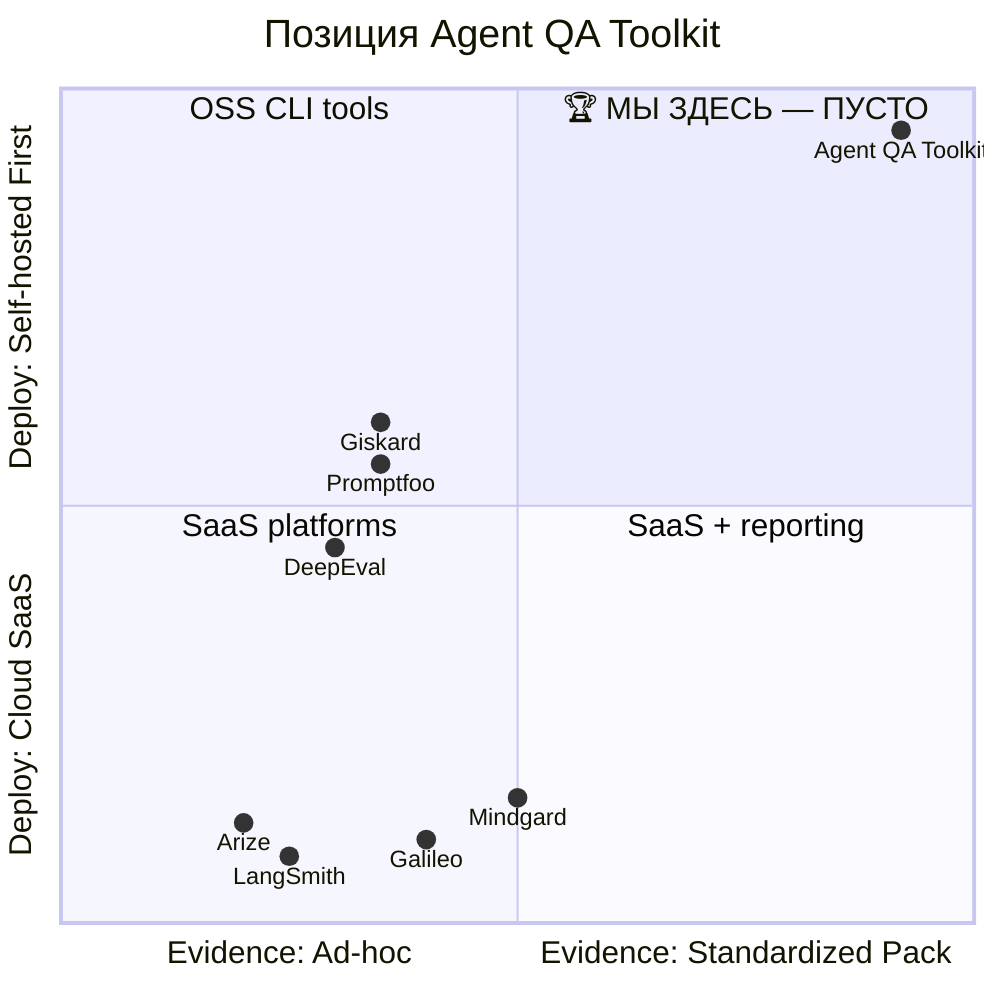
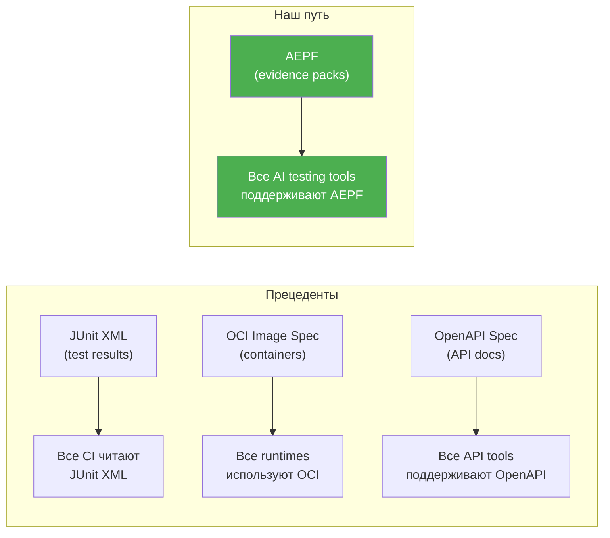
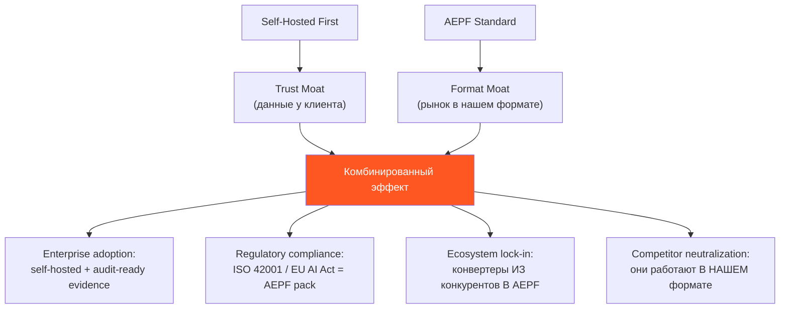
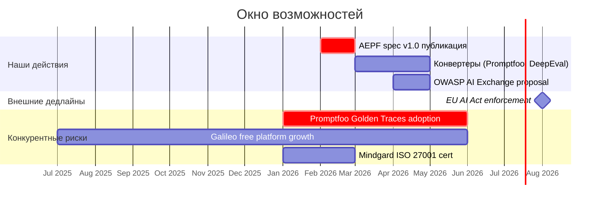

# Конкурентное преимущество: первенство по двум осям

> Актуальный статус на 15 февраля 2026. Подтверждено анализом 12+ конкурентов и всех open-source протоколов.

---

## Два направления, где мы — первые



> [!IMPORTANT]
> Правый верхний квадрант **пуст** — кроме нас, никто одновременно не предлагает **стандартизированный evidence-пакет** и **self-hosted first** модель. Это blue ocean.

---

## Ось 1: Self-Hosted First

### Что это значит

Все данные (traces агентов, security signals, PII) **никогда не покидают инфраструктуру клиента**. Toolkit работает полностью offline, включая HTML-viewer для отчётов.

### Кто ещё self-hosted?

| Конкурент | Self-hosted? | Детали |
|-----------|:-:|---------|
| **Agent QA Toolkit** | ✅ **Full** | CLI, Docker, полностью оффлайн. Нулевые внешние зависимости |
| Promptfoo | 🟡 Частично | CLI — OSS, но cloud dashboard = SaaS. Red-teaming результаты уходят в облако |
| DeepEval | 🟡 Частично | Framework — OSS, но Confident AI platform = SaaS. Нет air-gapped mode |
| Giskard | 🟡 Частично | Python lib — OSS, Hub — enterprise SaaS |
| Galileo | ❌ | SaaS only. Данные на их серверах |
| LangSmith | ❌ | SaaS only. LangChain ecosystem |
| Mindgard | ❌ | SaaS only |
| Arize | ❌ | SaaS only (Phoenix — OSS, но observability, не testing) |

### Почему это монопольно

```
Enterprise decision flow:
┌─────────────────────────────────────────────────────────────┐
│ "Можем ли мы отправить traces наших AI-агентов               │
│  на чужой SaaS-сервер?"                                      │
│                                                              │
│  Юристы: "НЕТ. GDPR/SOC2/ISO 42001 требуют контроля."       │
│  Security: "НЕТ. Traces содержат PII и business logic."     │
│  CTO: "Значит самостоятельно собирайте или не тестируйте."           │
│                                                              │
│  → Единственный вариант: self-hosted toolkit                 │
│  → Agent QA Toolkit — ЕДИНСТВЕННЫЙ полностью self-hosted     │
└─────────────────────────────────────────────────────────────┘
```

### Прецеденты успеха self-hosted first

| Компания | Модель | Результат |
|----------|--------|-----------|
| **GitLab** | Self-hosted → hosted → IPO | $14B valuation |
| **Grafana** | OSS core → Cloud | Доминирование в observability |
| **Mattermost** | Self-hosted Slack alternative | $300M+ valuation |
| **n8n** | Self-hosted automation → cloud | $60M funding |
| **MinIO** | Self-hosted S3 → enterprise | $1B+ valuation |

**Паттерн**: Self-hosted создаёт trust → adoption → switching cost → enterprise revenue.

---

## Ось 2: Evidence Pack (AEPF) — открытый стандарт

### Что это значит

Портативный, self-contained пакет с результатами тестирования AI-агента:
- `compare-report.json` — machine-readable результаты
- `report.html` — offline viewer, работает без сервера
- Manifests с SHA-256 integrity
- Security signals, RCA, gate recommendation
- Redaction support для PII

### Кто ещё делает evidence packs?

| Конкурент | Evidence pack? | Что вместо |
|-----------|:-:|------------|
| **Agent QA Toolkit** | ✅ **Полный** | Self-contained directory: JSON + HTML + manifests + integrity |
| Promptfoo | ❌ | Golden Traces — данные в их облаке или локальный JSON без packaging |
| DeepEval | ❌ | Результаты в Confident AI dashboard или stdout |
| Galileo | ❌ | SaaS dashboard. Нет экспорта |
| LangSmith | ❌ | SaaS dashboard. Эксперименты привязаны к аккаунту |
| Mindgard | ❌ | «Compliance-ready reports» — PDF/dashboard, не portable pack |
| Giskard | ❌ | HTML scan reports, но не versioned, не self-contained, без manifests |
| Arize | ❌ | Real-time dashboard |

### Открытые стандарты: ниша ПУСТА

| Существующий стандарт | Покрывает evidence packs? | Что покрывает |
|----------------------|:-:|---------------|
| A2A (Google → Linux Foundation) | ❌ | Agent-to-agent communication |
| MCP (Anthropic) | ❌ | Model ↔ tools connection |
| OASF | ❌ | Agent capability schemas |
| AGENTS.md (OpenAI) | ❌ | Agent instruction config |
| LangChain Agent Protocol | ❌ | Cross-framework agent API |
| JUnit XML | ❌ | Test results (не agent-specific, без security) |
| SARIF (Microsoft) | ❌ | Static analysis results (не agent testing) |
| **AEPF (мы)** | ✅ **Первые** | Agent testing evidence: results + security + gate + audit trail |

> [!CAUTION]
> На рынке **6 протоколов** для коммуникации между агентами, и **0 протоколов** для стандартизации результатов тестирования и аудита агентов. AEPF — первая попытка занять эту нишу.

### Аналогии: как стандарты захватывают рынок



> Не тот владеет рынком, кто пишет лучший код. А тот, **кто пишет формат файла.**

---

## Комбинированное преимущество: Self-Hosted + AEPF

Каждая ось сильна отдельно. Но **вместе** они создают непробиваемый moat:



| Сценарий конкурента | Наш ответ |
|-------------------|-----------|
| Galileo добавит evidence pack export | Экспорт будет в **AEPF формате** → мы остаёмся reference implementation |
| Promptfoo сделает Golden Traces portable | Конвертер `promptfoo → aepf` → их данные в нашем стандарте |
| Mindgard добавит QA-фичи | Их compliance reports → impоrt в AEPF → мы стандарт |
| Новый стартап выйдет на рынок | Им придётся поддерживать AEPF, если рынок уже принял формат |

---

## Timeline: окно для закрепления



> [!WARNING]
> **Окно: ~6 месяцев.** К августу 2026 (EU AI Act enforcement) стандарт должен быть опубликован, первые конвертеры готовы, OWASP proposal подан. После этого рынок кристаллизуется вокруг того, кто первый.

---

*Документ создан: 15 февраля 2026*
*Статус: подтверждено анализом 12+ конкурентов и всех открытых AI-протоколов*
