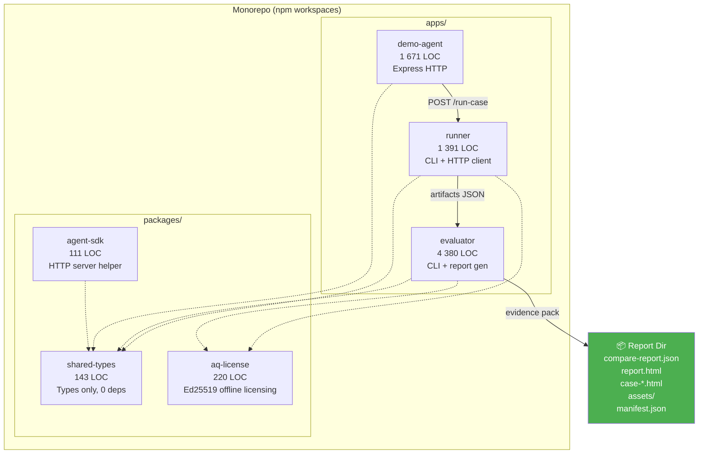

# Аудит продукта: Agent QA Toolkit v1.4.0

> **Полный анализ production-ready кодовой базы**
> Дата: 15 февраля 2026 | Версия: 1.4.0 | Contract: v5

---

## 📊 Общая статистика

| Метрика | Значение |
|---------|----------|
| **Всего LOC** (TypeScript) | **7 964** |
| **Продуктовый код** | 6 282 LOC (app + packages, без тестов) |
| **Тесты** | 503 LOC (3 файла, 45 тестов → ✅ все проходят) |
| **Demo** | 1 671 LOC (demo-agent + responses) |
| **Схемы** | 233 LOC (JSON Schema v5) |
| **Скрипты** | 10 файлов (CLI helpers, E2E, license, PVIP) |
| **Документация** | 22 markdown-файла + README (711 LOC) |
| **Node** | ≥20 (строгое) |
| **TypeScript** | 5.4.5 (strict, exactOptionalPropertyTypes, noUncheckedIndexedAccess, no `any`) |

---

## 🏗️ Архитектура



---

## 📦 Модули: детальный разбор

### 1. Evaluator (4 380 LOC) — ядро продукта

Самый большой и критичный модуль. Грамотно разделён на слои:

| Файл | LOC | Роль |
|------|-----|------|
| [evaluator.ts](file:///Users/tatanapanfilova/Documents/Project/tool/apps/evaluator/src/evaluator.ts) | 1 401 | CLI/IO orchestrator: чтение файлов, конфигурация, сборка отчёта |
| [core.ts](file:///Users/tatanapanfilova/Documents/Project/tool/apps/evaluator/src/core.ts) | 756 | **Pure functions** — assertions, RCA, policy rules, gate/risk. Нет side-effects |
| [htmlReport.ts](file:///Users/tatanapanfilova/Documents/Project/tool/apps/evaluator/src/htmlReport.ts) | 1 129 | HTML renderer (offline, self-contained, zero external dependencies) |
| [replayDiff.ts](file:///Users/tatanapanfilova/Documents/Project/tool/apps/evaluator/src/replayDiff.ts) | 490 | Per-case baseline vs new visual diff |
| [manifest.ts](file:///Users/tatanapanfilova/Documents/Project/tool/apps/evaluator/src/manifest.ts) | 86 | SHA-256 manifest для evidence integrity |
| [redactionCheck.ts](file:///Users/tatanapanfilova/Documents/Project/tool/apps/evaluator/src/redactionCheck.ts) | 28 | Verification: находит не-редактированные маркеры |
| [securityScanner.ts](file:///Users/tatanapanfilova/Documents/Project/tool/apps/evaluator/src/securityScanner.ts) | 21 | **Plugin interface** для security scanners |
| [version.ts](file:///Users/tatanapanfilova/Documents/Project/tool/apps/evaluator/src/version.ts) | 1 | `TOOLKIT_VERSION = "1.4.0"` |

**Что делает evaluator:**
- Читает baseline + new артефакты из runner
- Выполняет 7+ assertions на каждый кейс (tool_required, tool_sequence, must_include, must_not_include, json_schema, evidence_refs, hallucination_signal, tool_execution)
- Назначает root_cause (RCA): `tool_failure | format_violation | missing_required_data | wrong_tool_choice | hallucination_signal | missing_case | unknown`
- Вычисляет `gate_recommendation`: `none | require_approval | block`
- Вычисляет `risk_level` из gate: `low | medium | high`
- Сканирует security signals (PII, secrets, prompt injection) с confidence + severity
- Генерирует evidence manifest с SHA-256
- Создаёт HTML report + per-case diff HTML
- Валидирует отчёт по JSON Schema v5

#### Архитектурное качество evaluator: ✅ **Высокое**
- `core.ts` — чистые функции без side-effects (идеально для тестов)
- Plugin interface для security scanners (`SecurityScanner` type)
- CLI layer отделён от бизнес-логики
- Proper error handling с `CliUsageError` (exit code 2)
- Audit logging (JSONL, опционально)

---

### 2. Runner (1 391 LOC) — сборщик артефактов

| Файл | LOC | Роль |
|------|-----|------|
| [runner.ts](file:///Users/tatanapanfilova/Documents/Project/tool/apps/runner/src/runner.ts) | 1 130 | CLI + HTTP client с retry/backoff/timeout |
| [sanitize.ts](file:///Users/tatanapanfilova/Documents/Project/tool/apps/runner/src/sanitize.ts) | 38 | Deep recursive redaction |
| [load-test.ts](file:///Users/tatanapanfilova/Documents/Project/tool/apps/runner/src/load-test.ts) | 210 | Load testing tool |

**Что делает runner:**
- Отправляет `POST /run-case` агенту для каждого test case
- Записывает артефакты: `<caseId>.json` + `run.json` + `assets/`
- **Retry**: configurable retries + exponential backoff
- **Timeout**: per-request timeout с AbortController
- **Concurrency**: configurable parallel execution
- **Redaction**: 4 preset-а (none, internal_only, transferable, transferable_extended)
- **Extended redaction**: email, CUST-IDs, tickets, messages, tokens, IP, phone, CC, JWT
- **Full body preservation**: saves error response bodies для forensics
- **Retention**: автоматическое удаление старых runs по `--retentionDays`
- **License enforcement**: `consumeRunOrThrow()` — проверка и трекинг использования

#### Архитектурное качество runner: ✅ **Высокое**
- Production-grade retry/backoff/timeout pattern
- Streaming body read (`readBodySnippet`) для bounded memory
- Deep recursive sanitization
- Proper socket error handling

---

### 3. Demo-Agent (1 671 LOC) — демонстрационный агент

| Файл | LOC | Роль |
|------|-----|------|
| [index.ts](file:///Users/tatanapanfilova/Documents/Project/tool/apps/demo-agent/src/index.ts) | 399 | Express HTTP server + matrix cases |
| [responses.ts](file:///Users/tatanapanfilova/Documents/Project/tool/apps/demo-agent/src/responses.ts) | 1 201 | Deterministic baseline/new responses |
| [types.ts](file:///Users/tatanapanfilova/Documents/Project/tool/apps/demo-agent/src/types.ts) | 71 | Request types |

**Что делает demo-agent:**
- Детерминистичные ответы для 14+ test cases (correctness + robustness)
- **Matrix cases** — edge-case testing: HTTP 500 (small/large), timeout (20s), socket drop, partial JSON, empty body, invalid JSON, wrong types, missing fields, extra fields, large payloads (1MB, 5MB), huge strings (900K), trace diffs
- Redaction support через header/env

> [!NOTE]
> Demo-agent — **не продуктовый код для клиентов**. Это инструмент для разработки и тестирования пайплайна. Клиент подключает своего агента через `/run-case` endpoint.

---

### 4. Packages (474 LOC total)

#### shared-types (143 LOC)
Каноничные типы контракта. **Нулевые зависимости, нулевой runtime**. Только TypeScript types:
- `Version`, `FetchFailureClass`, `NetErrorKind`
- Events: `ToolCallEvent`, `ToolResultEvent`, `RetrievalEvent`, `FinalOutputEvent`, `RunEvent`
- `ProposedAction` с evidence_refs и risk_level/risk_tags
- `RunnerFailureArtifact` — полный failure record
- `AgentResponse` — main contract
- `RootCause` — 7 classifications

#### agent-sdk (111 LOC)
TypeScript SDK для быстрого подключения агента:
- `createRunCaseServer()` — HTTP server с health check
- `wrapSimpleAgent()` — adapter для простых агентов

> [!TIP]
> Также есть Python SDK: `scripts/agent-sdk-python/agent_sdk.py`

#### aq-license (220 LOC)
Полная offline лицензионная система:
- Ed25519 digital signature verification
- Monthly + Pack license types
- Usage tracking (runs per month / total)
- Canonical JSON serialization для подписи
- Env-based config (`AQ_LICENSE_PATH`, `AQ_LICENSE_PUBLIC_KEY`, `AQ_LICENSE_REQUIRED`)

---

## ✅ Тесты и качество

### Unit тесты
| Файл | Тестов | Статус |
|------|--------|--------|
| [core.test.ts](file:///Users/tatanapanfilova/Documents/Project/tool/apps/evaluator/src/core.test.ts) | 39 | ✅ Pass |
| [sanitize.test.ts](file:///Users/tatanapanfilova/Documents/Project/tool/apps/runner/src/sanitize.test.ts) | 3 | ✅ Pass |
| [redactionCheck.test.ts](file:///Users/tatanapanfilova/Documents/Project/tool/apps/evaluator/src/redactionCheck.test.ts) | 3 | ✅ Pass |
| **Итого** | **45** | **✅ 100% pass, 666ms** |

### Покрытие тестами
| Модуль | Покрытие | Комментарий |
|--------|----------|-------------|
| `core.ts` (assertions, RCA, gates) | ✅ Хорошее | 39 тестов, основные paths |
| `sanitize.ts` (redaction) | ✅ Хорошее | 3 preset-а, deep recursion |
| `redactionCheck.ts` | ✅ Покрыто | Marker detection |
| `evaluator.ts` (orchestrator) | ⚠️ Нет unit тестов | Покрыто E2E через `toolkit-tests.mjs` |
| `runner.ts` | ⚠️ Нет unit тестов | Покрыто E2E |
| `htmlReport.ts` | ⚠️ Нет unit тестов | Покрыто E2E |
| `replayDiff.ts` | ⚠️ Нет unit тестов | Покрыто E2E |
| `aq-license` | ⚠️ Нет unit тестов | Покрыто скриптами |

### E2E и интеграционные тесты
- `scripts/toolkit-tests.mjs` — полный E2E pipeline: lint + typecheck + demo run + schema validation + PVIP verify
- `scripts/demo-e2e.mjs` — multi-suite E2E (correctness + robustness)
- `scripts/pvip-verify.mjs` — portability + manifest integrity checks
- **Load testing**: `load-test.ts` с concurrency + iterations + allowFail

### Инструменты качества
| Инструмент | Конфигурация | Статус |
|------------|-------------|--------|
| TypeScript | strict + exactOptionalPropertyTypes + noUncheckedIndexedAccess | ✅ |
| ESLint | v9 flat config + @typescript-eslint | ✅ |
| Prettier | semi: true, singleQuote: false | ✅ |
| Vitest | v4.0.18 | ✅ |
| npm audit | Встроен в demo pipeline | ✅ |
| Node version | .nvmrc → 20 | ✅ |

---

## 📋 Контракт v5: что в отчёте

### Top-level (compare-report.json)
| Поле | Статус | Описание |
|------|--------|----------|
| `contract_version: 5` | ✅ Required | Версия контракта |
| `report_id` | ✅ Required | UUID отчёта |
| `meta` | ✅ Required | `toolkit_version`, `spec_version`, `generated_at`, `run_id` |
| `environment` | ✅ Optional | `agent_id`, `model`, `prompt_version`, `tools_version` |
| `summary` | ✅ Required | Pass counts, regressions, quality, security, risk, coverage |
| `quality_flags` | ✅ Required | `self_contained`, `portable_paths`, missing/violations/large |
| `items[]` | ✅ Required | Per-case results |
| `compliance_mapping` | ✅ Optional | Framework/clause/evidence mapping (in schema) |
| `repro` | ✅ Optional | Repro bundle manifest href |
| `summary_by_suite` | ✅ Present | Per-suite breakdown |

### Per-item (items[])
| Поле | Статус |
|------|--------|
| `case_id`, `title`, `suite` | ✅ |
| `case_status` (executed/missing/filtered_out) | ✅ |
| `baseline_pass`, `new_pass` | ✅ |
| `data_availability` (baseline + new status) | ✅ |
| `artifacts` (replay_diff_href, case_response_href, etc.) | ✅ |
| `trace_integrity` (baseline + new status) | ✅ |
| `security` (baseline + new signals with severity/confidence/evidence_refs) | ✅ |
| `risk_level` (low/medium/high) | ✅ |
| `risk_tags` | ✅ |
| `gate_recommendation` (none/require_approval/block) | ✅ |
| `assertions[]` (name/pass/details) | ✅ In schema |
| `baseline_root`, `new_root` (RCA) | ✅ |
| `failure_summary` | ✅ Optional |
| `recommended_policy_rules` | ✅ |
| `preventable_by_policy` | ✅ |

---

## 🐳 Deployment

### Docker Compose
Три сервиса с dependency chain:
```
demo-agent (health check) → runner (depends_on healthy) → evaluator (depends_on completed)
```
- Volume mounts для runs + reports
- Proper health check endpoint

### Self-hosted
- No SaaS, no accounts, no external calls
- All data on local disk
- Air-gapped compatible
- Retention management (`--retentionDays`)
- Audit log (JSONL, optional)

---

## 🔐 Security features

| Feature | Реализация | Продакшн? |
|---------|-----------|:-:|
| **PII redaction** (email, customer IDs, tickets) | `sanitize.ts` — deep recursive | ✅ |
| **Token redaction** (API keys, secrets) | Preset `transferable` | ✅ |
| **Extended redaction** (IP, phone, CC, JWT) | Preset `transferable_extended` | ✅ |
| **Redaction verification** | `redactionCheck.ts` + `--strictRedaction` | ✅ |
| **Security signal detection** (output) | `computeSecuritySide()` in core.ts | ✅ |
| **Signal kinds** | PII, secret, prompt_injection, unsafe action, etc. | ✅ |
| **Signal severity** | low / medium / high / critical | ✅ |
| **Signal confidence** | low / medium / high | ✅ |
| **Evidence refs on signals** | manifest_key linking | ✅ |
| **Plugin interface** | `SecurityScanner` type | ✅ |
| **License verification** | Ed25519 sign/verify | ✅ |
| **Manifest integrity** | SHA-256 per artifact | ✅ |
| **Portability checks** | No `../`, no abs paths, no `://` in hrefs | ✅ |
| **Audit logging** | JSONL (runner + evaluator) | ✅ |

---

## 📑 Документация

### Client-facing docs
| Документ | Описание |
|----------|----------|
| [README.md](file:///Users/tatanapanfilova/Documents/Project/tool/README.md) (711 LOC) | Полный quickstart, CLI usage, CI gating model, contracts |
| [aepf-spec-v1.md](file:///Users/tatanapanfilova/Documents/Project/tool/docs/aepf-spec-v1.md) | AEPF specification |
| [report-contract-v5.md](file:///Users/tatanapanfilova/Documents/Project/tool/docs/report-contract-v5.md) | Current contract spec |
| [agent-integration-contract.md](file:///Users/tatanapanfilova/Documents/Project/tool/docs/agent-integration-contract.md) | Agent HTTP API contract |
| [agent-artifact-contract-v1.md](file:///Users/tatanapanfilova/Documents/Project/tool/docs/agent-artifact-contract-v1.md) | Runner artifacts contract |
| [self-hosted.md](file:///Users/tatanapanfilova/Documents/Project/tool/docs/self-hosted.md) | Self-hosted policy |
| [self-hosted-deploy.md](file:///Users/tatanapanfilova/Documents/Project/tool/docs/self-hosted-deploy.md) | Deployment guide |
| [ci.md](file:///Users/tatanapanfilova/Documents/Project/tool/docs/ci.md) | CI integration guide |
| [license.md](file:///Users/tatanapanfilova/Documents/Project/tool/docs/license.md) | License management |
| [compliance-mapping.md](file:///Users/tatanapanfilova/Documents/Project/tool/docs/compliance-mapping.md) | Compliance framework mapping |
| [stages.md](file:///Users/tatanapanfilova/Documents/Project/tool/docs/stages.md) | Product stages roadmap |
| [release-checklist.md](file:///Users/tatanapanfilova/Documents/Project/tool/docs/release-checklist.md) | Release process |

### Versioned contracts
| Версия | Файл | Статус |
|--------|------|--------|
| v1 | report-contract-v1.md | Archived |
| v2 | report-contract-v2.md | Archived |
| v3 | report-contract-v3.md | Archived |
| **v5** | **report-contract-v5.md** | **Current** |

> [!NOTE]
> v4 пропущен — intentional jump from v3 → v5 (documented).

---

## 🎯 Вердикт по production readiness

### ✅ Что работает отлично

1. **Архитектура** — чистое разделение: pure logic (core.ts) / IO (evaluator.ts) / rendering (htmlReport.ts) / plugins (securityScanner.ts)
2. **Contract stability** — v5 с JSON Schema, backwards compatible `additionalProperties: true`
3. **Self-contained evidence pack** — полностью portable: HTML + JSON + manifests + SHA-256
4. **CI gating truth** — единый `gate_recommendation` → exit codes → CI integration
5. **Redaction pipeline** — 4 уровня, deep recursive, verification gate
6. **Error resilience** — retry/backoff/timeout, body streaming, socket error handling
7. **Licensing** — полная offline система с Ed25519 подписями
8. **Documentation** — comprehensive README, contract specs, deployment guides
9. **Quality tooling** — strict TS, ESLint v9, Vitest, npm audit, PVIP verify

### ⚠️ Что стоит усилить (product-уровень)

| # | Область | Текущее состояние | Рекомендация |
|---|---------|-------------------|-------------|
| 1 | **Unit test coverage** | 45 тестов на core/sanitize/redaction. Orchestrator/renderer/runner покрыты E2E | Добавить unit тесты для `manifest.ts`, `replayDiff.ts` render functions |
| 2 | **Assertions в items[]** | Определены в schema + CompareReport type, но ещё нужно подтвердить проброс в evaluator output | Верифицировать что `nEval.assertions` пробрасываются в `item` object |
| 3 | **CLI arg helpers duplication** | `normalizeArgv`, `hasFlag`, `getArg`, etc. дублируются в runner.ts и evaluator.ts | Вынести в `packages/cli-utils` |
| 4 | **Demo-agent redaction** | Отдельная реализация `maskString` (не использует `sanitize.ts`) | Объединить или задокументировать почему отдельно |
| 5 | **Load test выходит из apps** | `load-test.ts` в runner/src, но это утилита | Нормально для текущей структуры |

### 💡 Численная оценка

| Критерий | Оценка |
|----------|--------|
| Функциональная полнота Stage 1 | **9/10** |
| Code quality | **9/10** |
| Test coverage | **7/10** |
| Documentation | **9/10** |
| Security/Compliance readiness | **8/10** |
| Deployment readiness | **8/10** |
| Production stability | **8/10** |
| **Общая оценка** | **🟢 8.3/10 — Production Ready** |

---

*Аудит проведён 15 февраля 2026*
*Все 45 тестов прошли успешно (666ms)*
*Версия продукта: 1.4.0, контракт: v5*
